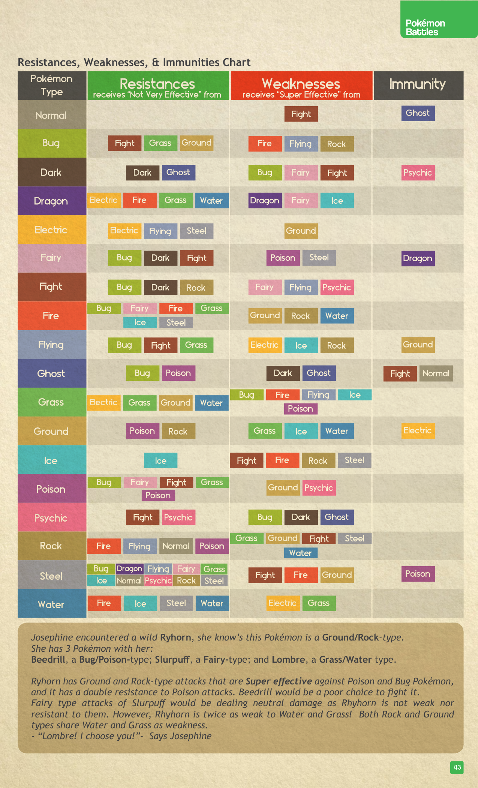

# Tipi Pokémon

## Descrizione Generale

> *"Questo mondo è pieno di diverse fonti di energia che i Pokémon possono controllare. Le assorbono come parte del loro corpo o le plasmano in potenti attacchi."*

Un Pokémon particolarmente abile nell'uso di un certo tipo di energia viene etichettato con quello che chiamiamo **Tipo**. Fino ad ora sono stati riconosciuti **18 Tipi** di Pokémon.

Alcuni Pokémon possono usare non solo uno, ma **due tipi di energia** contemporaneamente, ottenendo le resistenze e le debolezze di entrambi.

> 💡 *"Ci sono molti modi per vincere durante una battaglia: o sfrutti le debolezze del tuo avversario, o sfrutti i tuoi punti di forza. Un buon Allenatore sceglie il Pokémon giusto per l'occasione giusta, dentro e fuori dalla battaglia."*

---

## I 18 Tipi

| Tipo (EN) | Tipo (IT) | Descrizione |
|---|---|---|
| Normal | **Normale** | Pokémon non particolarmente abili nel controllare altre energie. |
| Bug | **Coleottero** | Creature insettoidi che traggono forza da una mentalità da sciame. |
| Dark | **Buio** | Controllano il potere delle emozioni negative, noti per azioni disonorevoli. |
| Dragon | **Drago** | Creature leggendarie che usano la rabbia interiore per distruggere tutto ciò che si oppone. |
| Electric | **Elettro** | Controllano le correnti elettriche; si alimentano e ricaricano con fulmini e tuoni. |
| Fairy | **Folletto** | Creature sfuggenti e birichine che portano sia gioia che lacrime a chi le vede. |
| Fighting | **Lotta** | Hanno imparato a usare il corpo come arma, alcuni materializzano la propria energia in attacchi. |
| Fire | **Fuoco** | Resistono al calore, producono e plasmano il fuoco per bruciare tutto sulla loro scia. |
| Flying | **Volante** | Controllano le correnti d'aria e dominano i cieli; le creature di terra non li raggiungono facilmente. |
| Ghost | **Spettro** | Esseri dell'oltretomba, si annidano nelle ombre e predano l'energia vitale dei vivi. |
| Grass | **Erba** | Pokémon dall'aspetto vegetale, si nutrono di luce solare. Alcuni crescono fiori, altri spine. |
| Ground | **Terra** | Vivono sotto terra, controllano il movimento della terra e tutte le sue proprietà. |
| Ice | **Ghiaccio** | Il ghiaccio e la neve hanno congelato i loro corpi; possono resistere e creare temperature glaciali. |
| Poison | **Veleno** | Portano veleno nel corpo, seminano malattia e pestilenza ovunque vadano. |
| Psychic | **Psico** | Si nutrono di energia mentale per usare la telecinesi. Tra gli esseri più intelligenti del pianeta. |
| Rock | **Roccia** | Il loro corpo è la loro armatura; creano frane e schiacciare i nemici sotto di sé. |
| Steel | **Acciaio** | Una fredda piastra d'acciaio copre i loro corpi; si comportano come macchine organiche, spietati e freddi. |
| Water | **Acqua** | Creature acquatiche che respirano sott'acqua; possono invocare la pioggia e sparare torrenti possenti. |

---

## Meccaniche di Tipo: Resistenze, Debolezze e Immunità

### *Not Very Effective* (Resistenza)

> *"Tutti i Tipi di Pokémon (con l'eccezione del tipo Normale) sono in grado di resistere a certi Tipi di Moves."*

| Campo | Dettaglio |
|---|---|
| **Effetto** | Il danno ricevuto è ridotto di **1 punto** dal totale. |
| **Quando si applica** | Quando il Pokémon difensore ha un Tipo che resiste al Tipo della Move in arrivo. |

### *Super Effective* (Debolezza)

> *"Tutti i Pokémon sono deboli a certi Tipi di Moves."*

| Campo | Dettaglio |
|---|---|
| **Effetto** | Il danno ricevuto aumenta di **1 punto aggiuntivo**. |
| **Requisito** | Il tiro di danno **deve ottenere almeno 1 successo** per applicare il bonus. |
| **Quando si applica** | Quando il Pokémon difensore ha un Tipo debole al Tipo della Move in arrivo. |

> ⚠️ Se il tiro di danno non ottiene nemmeno 1 successo, il danno base dell'attacco (1 punto minimo per attacco andato a segno) viene comunque inflitto, ma il bonus *Super Effective* **non si applica**.

### Immunità

> *"Alcuni Tipi di Pokémon sono immuni ad altri Tipi di danno specifici."*

| Campo | Dettaglio |
|---|---|
| **Effetto** | Il Pokémon **non riceve alcun danno** da attacchi di quel Tipo. |
| **Eccezione** | Le **Support Moves** (non di danno) possono comunque avere effetto anche se il Tipo è immune. |

### Doppia Resistenza / Doppia Debolezza

> *"Due Tipi possono condividere una resistenza: un Pokémon doppio-tipo può ridurre fino a 2 punti di danno da un attacco Not Very Effective contro entrambi i suoi Tipi."*

| Situazione | Effetto |
|---|---|
| **Doppia Resistenza** | Il Pokémon riduce il danno di **2 punti** (entrambi i Tipi resistono). |
| **Doppia Debolezza** | Il Pokémon subisce **2 punti di danno aggiuntivi** (entrambi i Tipi sono deboli). |

> 💡 La doppia debolezza è estremamente pericolosa: un Pokémon Terra/Roccia come Rhyhorn subisce **+2 danno** da attacchi di tipo Acqua o Erba, perché entrambi i suoi Tipi sono deboli a quei Tipi.

---

## Tabella Completa: Resistenze, Debolezze e Immunità

### Legenda
- **Resistenze** = Il Tipo riceve danno *Not Very Effective* (−1 danno) da queste Moves
- **Debolezze** = Il Tipo riceve danno *Super Effective* (+1 danno) da queste Moves
- **Immunità** = Il Tipo non riceve danno da queste Moves

| Tipo | Resistenze (−1 danno) | Debolezze (+1 danno) | Immunità (0 danno) |
|---|---|---|---|
| **Normale** | — | Lotta | Spettro |
| **Coleottero** | Lotta, Erba, Terra | Fuoco, Volante, Roccia | — |
| **Buio** | Buio, Spettro | Coleottero, Folletto, Lotta | Psico |
| **Drago** | Elettro, Fuoco, Erba, Acqua | Drago, Folletto, Ghiaccio | — |
| **Elettro** | Elettro, Volante, Acciaio | Terra | — |
| **Folletto** | Coleottero, Buio, Lotta | Veleno, Acciaio | Drago |
| **Lotta** | Coleottero, Buio, Roccia | Folletto, Volante, Psico | — |
| **Fuoco** | Coleottero, Folletto, Fuoco, Erba, Ghiaccio, Acciaio | Terra, Roccia, Acqua | — |
| **Volante** | Coleottero, Lotta, Erba | Elettro, Ghiaccio, Roccia | Terra |
| **Spettro** | Coleottero, Veleno | Buio, Spettro | Normale, Lotta |
| **Erba** | Elettro, Erba, Terra, Acqua | Coleottero, Fuoco, Volante, Ghiaccio, Veleno | — |
| **Terra** | Veleno, Roccia | Erba, Ghiaccio, Acqua | Elettro |
| **Ghiaccio** | Ghiaccio | Lotta, Fuoco, Roccia, Acciaio | — |
| **Veleno** | Coleottero, Folletto, Lotta, Erba, Veleno | Terra, Psico | — |
| **Psico** | Lotta, Psico | Coleottero, Buio, Spettro | — |
| **Roccia** | Fuoco, Volante, Normale, Veleno | Erba, Terra, Lotta, Acciaio, Acqua | — |
| **Acciaio** | Coleottero, Drago, Volante, Folletto, Erba, Ghiaccio, Normale, Psico, Roccia, Acciaio | Lotta, Fuoco, Terra | Veleno |
| **Acqua** | Fuoco, Ghiaccio, Acciaio, Acqua | Elettro, Erba | — |

> 💡 Il tipo **Acciaio** è il più resistente con ben **10 resistenze** e **1 immunità**, ma ha 3 debolezze comuni (Lotta, Fuoco, Terra). Il tipo **Ghiaccio** è il più fragile difensivamente con **4 debolezze** e una sola resistenza (sé stesso).

---

## Esempio dal Manuale

> *Josephine incontra un Rhyhorn selvatico, un Pokémon di tipo Terra/Roccia. Ha con sé 3 Pokémon: Beedrill (Coleottero/Veleno), Slurpuff (Folletto) e Lombre (Erba/Acqua).*

| Pokémon | Valutazione | Risultato |
|---|---|---|
| **Beedrill** (Coleottero/Veleno) | ❌ Gli attacchi Terra e Roccia di Rhyhorn sono *Super Effective* contro Coleottero e Veleno. Rhyhorn ha inoltre **doppia resistenza** a Veleno. | Scelta pessima. |
| **Slurpuff** (Folletto) | ⚠️ Gli attacchi Folletto infliggerebbero danno **neutro** — Rhyhorn non è debole né resistente al Folletto. | Scelta neutra. |
| **Lombre** (Erba/Acqua) | ✅ Rhyhorn ha **doppia debolezza** sia ad Acqua che ad Erba! Entrambi i Tipi di Rhyhorn (Terra e Roccia) condividono queste debolezze. | Scelta perfetta! |

> *"Lombre! I choose you!" — dice Josephine.*

> 💡 Questo esempio mostra l'importanza di conoscere le interazioni di Tipo: scegliere il Pokémon giusto può trasformare una battaglia difficile in una **vittoria schiacciante**, e viceversa.

---

## Correlati

- [[Come_Funziona_il_Combattimento]] — Come si calcolano Accuracy e Damage in battaglia
- [[Strategie_di_Combattimento]] — STAB, Critical Hit, Super Effective e altre strategie
- [[Status_Conditions]] — Le immunità di Tipo proteggono anche da certi Status Ailments
- [[Attributes_e_Skills]] — *Special* influenza il danno delle Moves a distanza basate sul Tipo
- [[Meteo_e_Scenario]] — Il meteo può potenziare certi Tipi
