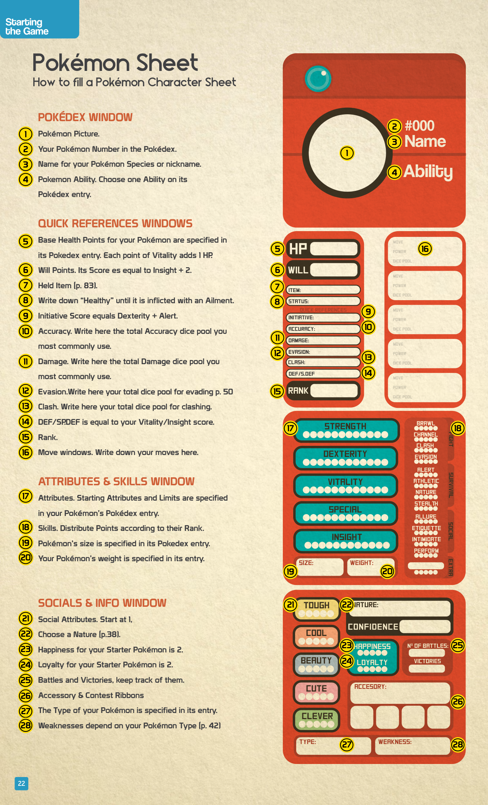

# Creazione Pokémon

## Descrizione Generale

> *"A Pokémon will be commanded by their trainer but within the game, they won't be controlled by a player. It's part of the storyteller's job to play and tell you how your Pokémon reacts to its surroundings or how it communicates with you."*

In Pokérole, il giocatore controlla direttamente solo l'Allenatore. Il Pokémon agisce in base agli ordini ricevuti, ma mantiene una propria volontà dettata dall'istinto di specie e dalla sua [[Natures|Nature]]. 

> ⚠️ I Pokémon **non sono umani**. Non parlano e non vedono il mondo come gli umani. Non hanno bisogno di un "Concept" complesso come i Trainer.

Due Pokémon della stessa specie vorranno le stesse cose, ma le loro Nature diverse cambieranno il modo in cui cercheranno di ottenerle.

---

## Scelta del Pokémon Iniziale (Starter)

Se stai iniziando la tua avventura, devi scegliere il tuo primo compagno. 

| Regola | Dettaglio |
|---|---|
| **Icona Starter** | Cerca nel Pokédex i Pokémon contrassegnati dall'icona speciale: sono le opzioni migliori per gli Allenatori novizi |
| **Rank** | Il Pokémon iniziale **ha lo stesso [[Ranking\|Rank]]** dell'Allenatore |
| **Affinità** | Scegli un Pokémon che si abbini alla personalità e al Concept del tuo Trainer |

> 💡 *"Non disperare se non hai potuto iniziare con il Pokémon che volevi, questo mondo è molto vasto e catturare Pokémon è metà del divertimento."*

---

## Leggere il Pokédex

Per creare il Pokémon, devi copiare le informazioni dalla sua voce nel Pokédex. I dati da trascrivere sono:

- Nome & Numero
- Dimensioni (Height) e Peso (Weight)
- [[Tipi_Pokemon|Tipo]]
- **Starting Attributes** (I valori di partenza dei 5 Attributes: *Strength, Dexterity, Vitality, Special, Insight*)
- **Limits** (Il punteggio massimo che il Pokémon può raggiungere in ciascun Attribute)
- Base HP
- Abilities (Scegli **una** Ability dalla lista)
- Moves (Vedi restrizioni sotto)

### Regole per le Moves

A differenza dei videogiochi, un Pokémon in Pokérole può ricordare più di 4 Moves.

| Regola | Dettaglio |
|---|---|
| **Numero di Moves** | Un Pokémon può imparare un numero di Moves pari a **Insight + 2** |
| **Rank delle Moves** | Tutte le Moves scelte devono essere del **Rank attuale del Pokémon o inferiore** |

---

## Compilazione della Pokémon Character Sheet

La scheda del Pokémon è divisa in quattro sezioni principali (28 campi in totale).

### Pokédex Window (Finestra Pokédex)

| # | Campo | Cosa Scrivere |
|---|---|---|
| **1** | **Immagine** | Il ritratto del Pokémon |
| **2** | **Numero Pokédex** | Il numero identificativo della specie |
| **3** | **Nome** | Il nome della specie o il soprannome scelto |
| **4** | **Ability** | L'Ability scelta dalla sua voce nel Pokédex |

### Quick References Window (Finestra Riferimenti Rapidi)

Valori calcolati per l'uso immediato in combattimento.

| # | Campo | Cosa Scrivere / Formula |
|---|---|---|
| **5** | **Base HP** | I Base Health Points indicati nel Pokédex |
| **6** | **HP (Health Points)** | **Base HP + *Vitality*** (Ogni punto di *Vitality* aggiunge 1 HP) |
| **7** | **Will Points** | **Insight + 2** |
| **8** | **Held Item** | L'oggetto tenuto in combattimento (vedi p. 83) |
| **9** | **Status** | Scrivi "Healthy" finché non subisce uno [[Status_Conditions\|Status Ailment]] |
| **10** | **Initiative** | ***Dexterity* + *Alert*** |
| **11** | **Accuracy** | La Dice Pool totale usata più di frequente per colpire |
| **12** | **Damage** | La Dice Pool totale usata più di frequente per il danno |
| **13** | **Evasion** | ***Dexterity* + *Evasion*** (vedi [[Strategie_di_Combattimento]]) |
| **14** | **Clash** | ***Strength*/*Special* + *Clash*** |
| **15** | **DEF / S.DEF** | **Defense** = punteggio di *Vitality*. **Special Defense** = punteggio di *Insight* |
| **16** | **Rank** | Il Rank attuale (uguale a quello dell'Allenatore per lo Starter) |
| **17-20** | **Moves** | Le Moves conosciute (massimo *Insight* + 2) |

### Attributes & Skills Window (Finestra Attributes e Skills)

| # | Campo | Cosa Scrivere |
|---|---|---|
| **21** | **Attributes** | I punteggi di *Strength*, *Dexterity*, *Vitality*, *Special* e *Insight* forniti dal Pokédex. I quadratini piccoli segnano il **Limit** |
| **22** | **Skills** | Distribuisci i punti Skill in base al Rank (stesse regole del Trainer) |
| **23** | **Size** | Le dimensioni indicate nel Pokédex |
| **24** | **Weight** | Il peso indicato nel Pokédex |

### Socials & Info Window (Finestra Social e Info)

| # | Campo | Cosa Scrivere |
|---|---|---|
| **25** | **Social Attributes** | Partono da **1**. I punti extra si ottengono tramite allenamento o evoluzione |
| **26** | **Nature** | Scegli una [[Natures\|Nature]] (p. 38) |
| **27** | **Happiness e Loyalty** | Per il Pokémon Starter, partono entrambe da **2**. (vedi [[Happiness_e_Loyalty]]) |
| **28** | **Info Varie** | Tipo, Debolezze, numero di battaglie e vittorie, accessori/nastri vinti |

---

## Correlati

- [[Scheda_Allenatore]] — Come creare e compilare il personaggio dell'Allenatore
- [[Natures]] — Il comportamento dettato dalla Natura del Pokémon
- [[Happiness_e_Loyalty]] — Gestione della lealtà e della felicità del Pokémon
- [[Come_Funziona_il_Combattimento]] — Utilizzo delle formule rapide di Initiative, Evasion e Clash
- [[Attributes_e_Skills]] — La differenza tra Skills del Trainer e del Pokémon
