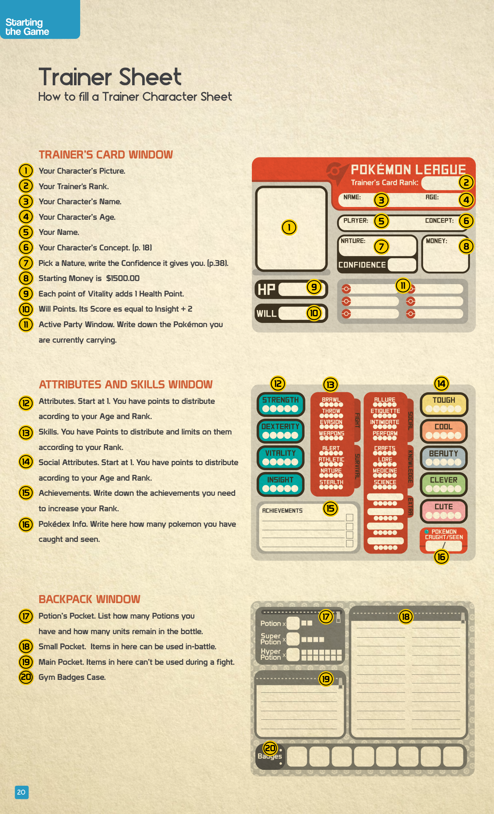

# Scheda Allenatore

## Descrizione Generale

La **Trainer Character Sheet** è il documento che raccoglie tutte le informazioni del tuo personaggio. È divisa in **tre finestre** principali, ciascuna con campi numerati. Questa pagina spiega campo per campo cosa scrivere e come calcolare ogni valore.

> Per la procedura completa di creazione del personaggio, vedi [[Creazione_Personaggio]].

---

## Trainer's Card Window (Finestra Carta dell'Allenatore)

La parte superiore della scheda, che rappresenta la "carta d'identità" del Trainer nel mondo Pokémon.

| # | Campo | Cosa Scrivere | Note |
|---|---|---|---|
| **1** | **Immagine** | Il ritratto del tuo personaggio | Disegno, avatar o descrizione |
| **2** | **Rank** | Il [[Ranking|Rank]] attuale del Trainer | I nuovi personaggi partono come *Starter* |
| **3** | **Nome** | Il nome del personaggio | — |
| **4** | **Età** | L'età del personaggio | Influenza i punti Attribute/Social (vedi tabella sotto) |
| **5** | **Nome del Giocatore** | Il tuo nome reale | — |
| **6** | **Concept** | L'occupazione/concept del personaggio | Vedi [[Creazione_Personaggio#Step 1 Trainer Concept|Trainer Concept]] |
| **7** | **Nature e Confidence** | La [[Natures|Nature]] scelta e la *Confidence* che conferisce | Vedi pp. 38-41 del manuale |
| **8** | **Denaro Iniziale** | **$1.500,00** | Il budget di partenza per ogni nuovo Trainer |
| **9** | **HP** | *Vitality* + Base HP | Ogni punto di *Vitality* aggiunge 1 [[HP_e_Will|Health Point]] |
| **10** | **Will Points** | *Insight* + 2 | Vedi [[HP_e_Will]] |
| **11** | **Party Attivo** | I Pokémon attualmente nel tuo team | Massimo 6 Pokémon nel party attivo |

---

## Attributes and Skills Window (Finestra Attributes e Skills)

La sezione centrale della scheda, dove si registrano tutte le capacità del personaggio.

### Attributes (Campo 12)

I 4 [[Attributes_e_Skills|Attributes]] del Trainer (i Pokémon ne hanno 5, includendo *Special*):

| Attribute | Partenza | Descrizione |
|---|---|---|
| **Strength** | 1 | Forza fisica, potenza dei colpi corpo a corpo |
| **Vitality** | 1 | Resistenza, salute, contribuisce al calcolo degli HP |
| **Dexterity** | 1 | Agilità, velocità, riflessi |
| **Insight** | 1 | Percezione, intuizione, contribuisce al calcolo dei Will Points |

> Distribuisci i punti extra in base a **Età** e **[[Ranking|Rank]]**:

| Età | Extra Attribute Points |
|---|---|
| Kids | 0 |
| **Teens*** | **2** |
| Adults | 4 |
| Seniors | 3 |

\* *Età base per le nuove partite.*

| [[Ranking|Rank]] | Extra Attribute Points |
|---|---|
| *Starter* | 0 |
| *Beginner* | +2 |
| *Amateur* | +4 |
| *Ace* | +6 |
| *Professional* | +8 |

### Skills (Campo 13)

Le 16 [[Attributes_e_Skills|Skills]] divise in 4 categorie:

| Categoria | Skills |
|---|---|
| **Fight** | *Brawl*, *Throw*, *Evasion*, *Weapons* |
| **Survival** | *Alert*, *Athletic*, *Nature*, *Stealth* |
| **Contest** | *Empathy*, *Etiquette*, *Intimidate*, *Perform* |
| **Knowledge** | *Crafts*, *Lore*, *Medicine*, *Science* |

> Distribuisci i punti Skill in base al [[Ranking|Rank]]:

| Rank | Skill Points | Skill Limit |
|---|---|---|
| *Starter* | 5 | 1 |
| *Beginner* | +4 | 2 |
| *Amateur* | +3 | 3 |
| *Ace* | +2 | 4 |
| *Professional* | +1 | 5 |

> ⚠️ **Regola fondamentale:** Assegna tutti i punti Skill di un Rank **prima** di assegnare quelli del Rank successivo. Una Skill non può superare lo Skill Limit del Rank in cui stai assegnando i punti.

### Social Attributes (Campo 14)

I 5 [[Attributes_e_Skills|Social Attributes]]:

| Social Attribute | Partenza | Descrizione |
|---|---|---|
| **Tough** | 1 | Aspetto forte e minaccioso |
| **Cool** | 1 | Carisma, fascino, stile |
| **Beauty** | 1 | Grazia, eleganza, aspetto |
| **Cute** | 1 | Tenerezza, simpatia |
| **Clever** | 1 | Astuzia, intelligenza dimostrativa |

> Distribuisci i punti extra in base a **Età** e **Rank** (stesse tabelle degli Attributes normali, con colonna Social separata).

| Età | Extra Social Points |
|---|---|
| Kids | 0 |
| **Teens*** | **2** |
| Adults | 4 |
| Seniors | 6 |

> 💡 I **Seniors** ottengono **6 punti Social** (il massimo per Età), riflettendo l'enorme esperienza nelle relazioni accumulata nel tempo. È un trade-off: meno *Strength* e *Dexterity*, ma più capacità sociali.

### Achievements (Campo 15)

Scrivi qui gli **Achievement** necessari per salire al Rank successivo. Ogni Rank richiede obiettivi specifici che devono essere completati prima di poter avanzare. Vedi [[Ranking]] per i dettagli.

### Pokédex Info (Campo 16)

| Dato | Cosa Scrivere |
|---|---|
| **Pokémon Visti** | Il numero totale di Pokémon che hai incontrato |
| **Pokémon Catturati** | Il numero totale di Pokémon che hai catturato |

---

## Backpack Window (Finestra Zaino)

La parte inferiore della scheda, che tiene traccia dell'inventario del Trainer.

| # | Sezione | Contenuto | Uso in Combattimento |
|---|---|---|---|
| **17** | **Potion's Pocket** | Quante Pozioni possiedi e quante **unità restano** nella bottiglia | ✅ Sì |
| **18** | **Small Pocket** | Oggetti piccoli (Bacche, Antidoti, etc.) | ✅ Sì — utilizzabili **durante** il combattimento |
| **19** | **Main Pocket** | Oggetti grandi o strumenti (Canne da pesca, Biciclette, etc.) | ❌ No — **non** utilizzabili durante il combattimento |
| **20** | **Gym Badges Case** | Le Medaglie della Palestra ottenute | — |

> 💡 La distinzione tra **Small Pocket** e **Main Pocket** è fondamentale in battaglia: solo gli oggetti nella Small Pocket possono essere usati dal Trainer durante un combattimento. Pianifica attentamente cosa portare!

> ⚠️ L'Allenatore che vuole usare un oggetto in combattimento deve spendere la propria azione di fine Round per farlo (vedi [[Come_Funziona_il_Combattimento#Trainer Actions|Trainer Actions]]).

---

## Checklist di Compilazione

| Step | Campo | Valore da Calcolare/Inserire |
|---|---|---|
| 1 | Nome, Età, Concept | Dalla fase di creazione del personaggio |
| 2 | Nature + Confidence | Scegli dalla tabella delle [[Natures]] |
| 3 | Attributes | Base 1 + Extra (Età) + Extra (Rank) |
| 4 | Social Attributes | Base 1 + Extra (Età) + Extra (Rank) |
| 5 | Skills | Punti per Rank, rispettando lo Skill Limit |
| 6 | HP | Base HP + *Vitality* |
| 7 | Will | *Insight* + 2 |
| 8 | Denaro | $1.500 |
| 9 | Party | Pokémon iniziale (vedi [[Creazione_Pokemon]]) |
| 10 | Zaino | Equipaggiamento iniziale |

---

## Esempio di Compilazione: Trainer *Starter* — Teen

| Campo | Valore | Calcolo |
|---|---|---|
| **Rank** | *Starter* | — |
| **Età** | Teen (15 anni) | — |
| **Attribute Points** | 2 extra (Età) + 0 (Rank) = **2** | Distribuiti tra *Str*, *Vit*, *Dex*, *Ins* |
| **Social Points** | 2 extra (Età) + 0 (Rank) = **2** | Distribuiti tra *Tough*, *Cool*, *Beauty*, *Cute*, *Clever* |
| **Skill Points** | 5 | Skill Limit: 1 |
| **HP** | Base HP + *Vitality* | Es: se *Vitality* = 2, HP = Base + 2 |
| **Will** | *Insight* + 2 | Es: se *Insight* = 2, Will = 4 |
| **Denaro** | $1.500 | — |

> 💡 Con solo 2 Attribute Points e Skill Limit 1, un *Starter* Teen è volutamente limitato: le prime sessioni servono a crescere e scoprire il mondo. Non cercare di essere bravo in tutto — specializzati e cresci con il tuo Pokémon.

---

## Correlati

- [[Creazione_Personaggio]] — Procedura completa di creazione passo-passo
- [[Attributes_e_Skills]] — Dettaglio di tutti gli Attributes e Skills
- [[Ranking]] — Sistema dei Rank, Achievement e Benefits
- [[HP_e_Will]] — Calcolo dettagliato di HP e Will Points
- [[Natures]] — Le Natures e il sistema di Confidence
- [[Creazione_Pokemon]] — Come creare e compilare la scheda del Pokémon iniziale
- [[Come_Funziona_il_Combattimento]] — Azioni dell'Allenatore in battaglia (uso oggetti, scambio Pokémon)
