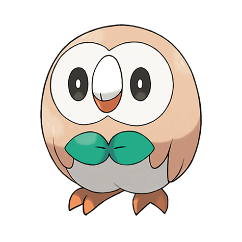

# Rowlet (#0722)

*Grass Quill Pokemon*

**Type:** Erba / Volante
**Abilities:** [[Overgrow]], [[Long Reach]] *(Hidden)*
**Base HP:** 3

> This is a shy Pokemon, it sleeps during the day, absorbing sunlight through its feathers, then at night becomes more active. It likes to keep sight of its trainer at all times, rotating its head 180° to do so.

---

## Statistiche (Attributes & Limits)

| Attribute | Base / Limit |
|---|---|
| **Strength** | 2/4 |
| **Dexterity** | 1/3 |
| **Vitality** | 2/4 |
| **Special** | 2/4 |
| **Insight** | 2/4 |

---

## Mosse (Learnset)

- **Starter:** [[Tackle|Tackle]], [[Leafage|Leafage]]
- **Beginner:** [[Growl|Growl]], [[Peck|Peck]], [[Astonish|Astonish]]
- **Amateur:** [[Razor_Leaf|Razor Leaf]], [[Foresight|Foresight]], [[Pluck|Pluck]], [[Synthesis|Synthesis]], [[Fury_Attack|Fury Attack]], [[Sucker_Punch|Sucker Punch]]
- **Ace:** [[Leaf_Blade|Leaf Blade]], [[Feather_Dance|Feather Dance]], [[Brave_Bird|Brave Bird]], [[Nasty_Plot|Nasty Plot]]
- **Pro:** [[Curse|Curse]], [[Haze|Haze]], [[Grass_Pledge|Grass Pledge]]

---

## Correlati

### Catena Evolutiva
- [[0722_Rowlet|Rowlet]]
- [[0723_Dartrix|Dartrix]]
- [[0724_Decidueye|Decidueye]]

