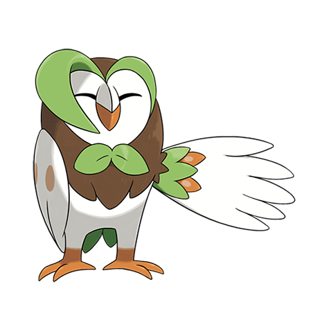

# Dartrix (#0723)

*Blade Quill Pokemon*

**Type:** Erba / Volante
**Abilities:** [[Overgrow]], [[Long Reach]] *(Hidden)*
**Base HP:** 4

> Dartix are vain creatures, they dislike it when their feathers are ruffled, even stopping midfight to groom them. Despite its elegant demeanor it hides an awkward personality, prone to panic and clumsiness.

---

## Statistiche (Attributes & Limits)

| Attribute | Base / Limit |
|---|---|
| **Strength** | 2/5 |
| **Dexterity** | 2/4 |
| **Vitality** | 2/5 |
| **Special** | 2/5 |
| **Insight** | 2/5 |

---

## Mosse (Learnset)

- **Starter:** [[Tackle|Tackle]], [[Leafage|Leafage]]
- **Beginner:** [[Growl|Growl]], [[Peck|Peck]], [[Astonish|Astonish]]
- **Amateur:** [[Razor_Leaf|Razor Leaf]], [[Foresight|Foresight]], [[Pluck|Pluck]], [[Synthesis|Synthesis]], [[Fury_Attack|Fury Attack]], [[Sucker_Punch|Sucker Punch]]
- **Ace:** [[Leaf_Blade|Leaf Blade]], [[Feather_Dance|Feather Dance]], [[Brave_Bird|Brave Bird]], [[Nasty_Plot|Nasty Plot]]
- **Pro:** [[Curse|Curse]], [[Haze|Haze]], [[Grass_Pledge|Grass Pledge]]

---

## Correlati

### Catena Evolutiva
- [[0722_Rowlet|Rowlet]]
- [[0723_Dartrix|Dartrix]]
- [[0724_Decidueye|Decidueye]]

