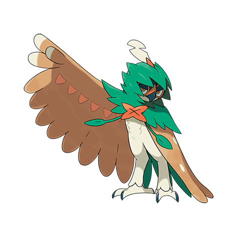

# Decidueye (#0724)

*Arrow Quill Pokemob*

**Type:** Erba / Spettro
**Abilities:** [[Overgrow]], [[Long Reach]] *(Hidden)*
**Base HP:** 5

> This Pokemon can shoot its own feathers as arrows in just a split of second. They are usually calm and collected but they are easily startled if taken by surprise. It is very rare as most of them are extinct.

---

## Statistiche (Attributes & Limits)

| Attribute | Base / Limit |
|---|---|
| **Strength** | 3/6 |
| **Dexterity** | 2/5 |
| **Vitality** | 2/5 |
| **Special** | 3/6 |
| **Insight** | 3/6 |

---

## Mosse (Learnset)

- **Starter:** [[Tackle|Tackle]], [[Leafage|Leafage]]
- **Beginner:** [[Growl|Growl]], [[Peck|Peck]], [[Astonish|Astonish]]
- **Amateur:** [[U_Turn|U-Turn]], [[Spirit_Shackle|Spirit Shackle]], [[Razor_Leaf|Razor Leaf]], [[Foresight|Foresight]], [[Pluck|Pluck]], [[Synthesis|Synthesis]], [[Fury_Attack|Fury Attack]], [[Sucker_Punch|Sucker Punch]]
- **Ace:** [[Leaf_Blade|Leaf Blade]], [[Feather_Dance|Feather Dance]], [[Brave_Bird|Brave Bird]], [[Nasty_Plot|Nasty Plot]]
- **Pro:** [[Ominous_Wind|Ominous Wind]], [[Baton_Pass|Baton Pass]], [[Frenzy_Plant|Frenzy Plant]]

---

## Correlati

### Catena Evolutiva
- [[0722_Rowlet|Rowlet]]
- [[0723_Dartrix|Dartrix]]
- [[0724_Decidueye|Decidueye]]

