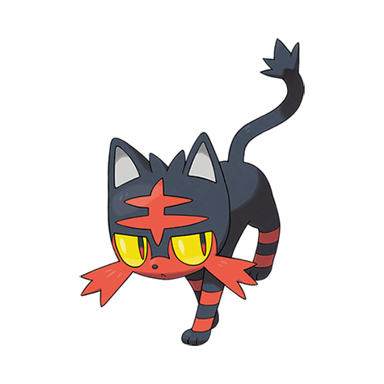

# Litten (#0725)

*Fire Cat Pokemon*

**Type:** Fuoco
**Abilities:** [[Blaze]], [[Intimidate]] *(Hidden)*
**Base HP:** 3

> It has an aloof personality and likes to be alone. Its fur produces flammable oils and its rough tongue lights them every time it grooms itself. Not recommended as a pet for they can cause house fires easily.

---

## Statistiche (Attributes & Limits)

| Attribute | Base / Limit |
|---|---|
| **Strength** | 2/4 |
| **Dexterity** | 2/5 |
| **Vitality** | 1/3 |
| **Special** | 2/4 |
| **Insight** | 1/3 |

---

## Mosse (Learnset)

- **Starter:** [[Scratch|Scratch]], [[Ember|Ember]]
- **Beginner:** [[Growl|Growl]], [[Lick|Lick]], [[Leer|Leer]]
- **Amateur:** [[Fire_Fang|Fire Fang]], [[Roar|Roar]], [[Bite|Bite]], [[Swagger|Swagger]], [[Fury_Attack|Fury Attack]], [[Thrash|Thrash]], [[Flamethrower|Flamethrower]]
- **Ace:** [[Scary_Face|Scary Face]], [[Flare_Blitz|Flare Blitz]], [[Outrage|Outrage]]
- **Pro:** [[Fake_Out|Fake Out]], [[Nasty_Plot|Nasty Plot]], [[Fire_Pledge|Fire Pledge]]

---

## Correlati

### Catena Evolutiva
- [[0725_Litten|Litten]]
- [[0726_Torracat|Torracat]]
- [[0727_Incineroar|Incineroar]]

