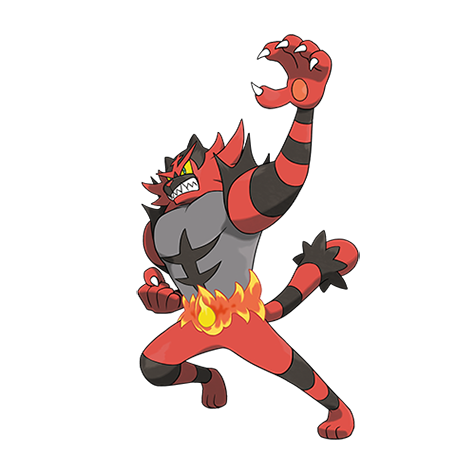

# Incineroar (#0727)

*Heel Pokemon*

**Type:** Fuoco / Buio
**Abilities:** [[Blaze]], [[Intimidate]] *(Hidden)*
**Base HP:** 6

> It has a bad reputation, some of them have attacked the opposing Trainer during battles. They are also prone to disobey their own Trainer, going for a more brutal fighting style to shred their foes to pieces.

---

## Statistiche (Attributes & Limits)

| Attribute | Base / Limit |
|---|---|
| **Strength** | 3/7 |
| **Dexterity** | 2/4 |
| **Vitality** | 2/5 |
| **Special** | 2/5 |
| **Insight** | 2/5 |

---

## Mosse (Learnset)

- **Starter:** [[Ember|Ember]], [[Scratch|Scratch]]
- **Beginner:** [[Lick|Lick]], [[Growl|Growl]], [[Leer|Leer]]
- **Amateur:** [[Throat_Chop|Throat Chop]], [[Darkest_Lariat|Darkest Lariat]], [[Bulk_Up|Bulk Up]], [[Fire_Fang|Fire Fang]], [[Roar|Roar]], [[Bite|Bite]], [[Swagger|Swagger]], [[Fury_Swipes|Fury Swipes]], [[Flamethrower|Flamethrower]], [[Thrash|Thrash]]
- **Ace:** [[Scary_Face|Scary Face]], [[Flare_Blitz|Flare Blitz]], [[Outrage|Outrage]], [[Cross_Chop|Cross Chop]]
- **Pro:** [[Revenge|Revenge]], [[Crunch|Crunch]], [[Blast_Burn|Blast Burn]]

---

## Correlati

### Catena Evolutiva
- [[0725_Litten|Litten]]
- [[0726_Torracat|Torracat]]
- [[0727_Incineroar|Incineroar]]

