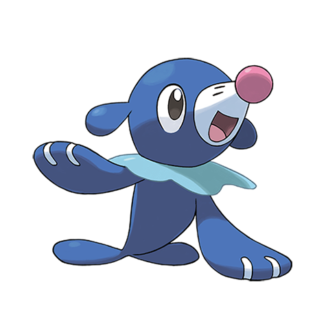

# Popplio (#0728)

*Sea Lion Pokemon*

**Type:** Acqua
**Abilities:** [[Torrent]], [[Liquid Voice]] *(Hidden)*
**Base HP:** 3

> A fun-loving Pokemon. It snorts water bubbles from its nose and balances them around, it is tenacious and diligent to train. They are agile swimmers and prefer acrobatic stunts to move on the ground.

---

## Statistiche (Attributes & Limits)

| Attribute | Base / Limit |
|---|---|
| **Strength** | 2/4 |
| **Dexterity** | 1/3 |
| **Vitality** | 2/4 |
| **Special** | 2/4 |
| **Insight** | 2/4 |

---

## Mosse (Learnset)

- **Starter:** [[Pound|Pound]], [[Water_Gun|Water Gun]]
- **Beginner:** [[Growl|Growl]], [[Disarming_Voice|Disarming Voice]], [[Baby_Doll_Eyes|Baby-Doll Eyes]]
- **Amateur:** [[Aqua_Jet|Aqua Jet]], [[Encore|Encore]], [[Bubble_Beam|Bubble Beam]], [[Sing|Sing]], [[Double_Slap|Double Slap]], [[Hyper_Voice|Hyper Voice]]
- **Ace:** [[Moonblast|Moonblast]], [[Captivate|Captivate]], [[Hydro_Pump|Hydro Pump]], [[Misty_Terrain|Misty Terrain]]
- **Pro:** [[Charm|Charm]], [[Aqua_Ring|Aqua Ring]], [[Water_Pledge|Water Pledge]]

---

## Correlati

### Catena Evolutiva
- [[0728_Popplio|Popplio]]
- [[0729_Brionne|Brionne]]
- [[0730_Primarina|Primarina]]

