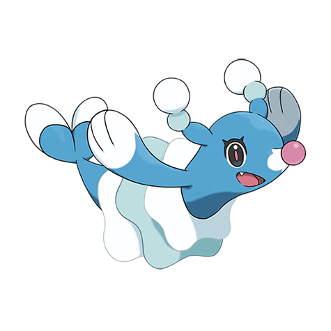

# Brionne (#0729)

*Pop Star Pokemon*

**Type:** Acqua
**Abilities:** [[Torrent]], [[Liquid Voice]] *(Hidden)*
**Base HP:** 4

> In the wild, each pack has their own songs and dances, Brionne practice them in the moonlight. It is cheerful and not timid at all, it forms friendships easily through dance movements.

---

## Statistiche (Attributes & Limits)

| Attribute | Base / Limit |
|---|---|
| **Strength** | 2/4 |
| **Dexterity** | 2/4 |
| **Vitality** | 2/4 |
| **Special** | 2/5 |
| **Insight** | 2/5 |

---

## Mosse (Learnset)

- **Starter:** [[Pound|Pound]], [[Water_Gun|Water Gun]]
- **Beginner:** [[Growl|Growl]], [[Disarming_Voice|Disarming Voice]], [[Baby_Doll_Eyes|Baby-Doll Eyes]]
- **Amateur:** [[Aqua_Jet|Aqua Jet]], [[Encore|Encore]], [[Bubble_Beam|Bubble Beam]], [[Sing|Sing]], [[Double_Slap|Double Slap]], [[Hyper_Voice|Hyper Voice]]
- **Ace:** [[Moonblast|Moonblast]], [[Captivate|Captivate]], [[Hydro_Pump|Hydro Pump]], [[Misty_Terrain|Misty Terrain]]
- **Pro:** [[Charm|Charm]], [[Aqua_Ring|Aqua Ring]], [[Water_Pledge|Water Pledge]]

---

## Correlati

### Catena Evolutiva
- [[0728_Popplio|Popplio]]
- [[0729_Brionne|Brionne]]
- [[0730_Primarina|Primarina]]

