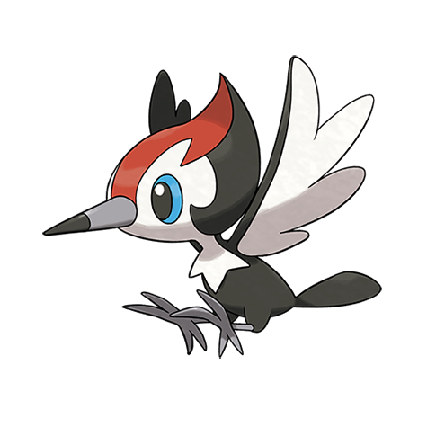

# Pikipek (#0731)

*Woodpecker Pokemon*

**Type:** Normale / Volante
**Abilities:** [[Keen Eye]], [[Skill Link]], [[Pickup]] *(Hidden)*
**Base HP:** 3

> Their beaks are incredibly strong, it takes them a few minutes to shatter rock. They eat berries and shoot the seeds to defend themselves. Pikipek don’t sing, but communicate with pecking sounds.

---

## Statistiche (Attributes & Limits)

| Attribute | Base / Limit |
|---|---|
| **Strength** | 2/5 |
| **Dexterity** | 2/4 |
| **Vitality** | 1/3 |
| **Special** | 1/3 |
| **Insight** | 1/3 |

---

## Mosse (Learnset)

- **Starter:** [[Peck|Peck]], [[Growl|Growl]]
- **Beginner:** [[Echoed_Voice|Echoed Voice]], [[Rock_Smash|Rock Smash]]
- **Amateur:** [[Supersonic|Supersonic]], [[Pluck|Pluck]], [[Roost|Roost]], [[Fury_Attack|Fury Attack]], [[Screech|Screech]], [[Drill_Peck|Drill Peck]]
- **Ace:** [[Bullet_Seed|Bullet Seed]], [[Feather_Dance|Feather Dance]], [[Hyper_Voice|Hyper Voice]]
- **Pro:** [[Uproar|Uproar]], [[Tailwind|Tailwind]], [[Mirror_Move|Mirror Move]]

---

## Correlati

### Catena Evolutiva
- [[0731_Pikipek|Pikipek]]
- [[0732_Trumbeak|Trumbeak]]
- [[0733_Toucannon|Toucannon]]

