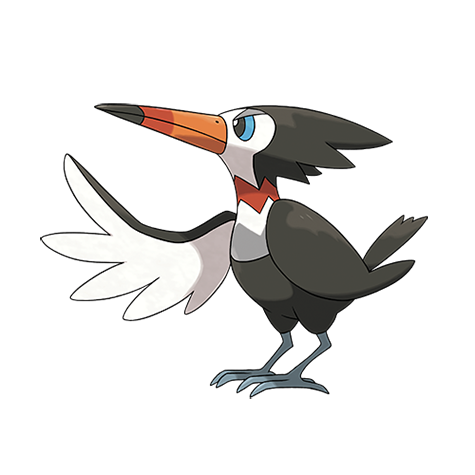

# Trumbeak (#0732)

*Bugle Beak Pokemon*

**Type:** Normale / Volante
**Abilities:** [[Keen Eye]], [[Skill Link]], [[Pickup]] *(Hidden)*
**Base HP:** 4

> This Pokemon bends its beak to produce a variety of sounds, much to the annoyance of the neighbors. It also shoots a burst of berry seeds to its foes, prey, or an unsuspecting passerby.

---

## Statistiche (Attributes & Limits)

| Attribute | Base / Limit |
|---|---|
| **Strength** | 2/5 |
| **Dexterity** | 2/5 |
| **Vitality** | 2/4 |
| **Special** | 1/3 |
| **Insight** | 2/4 |

---

## Mosse (Learnset)

- **Starter:** [[Growl|Growl]], [[Peck|Peck]]
- **Beginner:** [[Rock_Smash|Rock Smash]], [[Echoed_Voice|Echoed Voice]]
- **Amateur:** [[Rock_Blast|Rock Blast]], [[Supersonic|Supersonic]], [[Pluck|Pluck]], [[Roost|Roost]], [[Fury_Attack|Fury Attack]], [[Screech|Screech]]
- **Ace:** [[Drill_Peck|Drill Peck]], [[Bullet_Seed|Bullet Seed]], [[Feather_Dance|Feather Dance]], [[Hyper_Voice|Hyper Voice]]
- **Pro:** [[Uproar|Uproar]], [[Tailwind|Tailwind]], [[Mirror_Move|Mirror Move]]

---

## Correlati

### Catena Evolutiva
- [[0731_Pikipek|Pikipek]]
- [[0732_Trumbeak|Trumbeak]]
- [[0733_Toucannon|Toucannon]]

