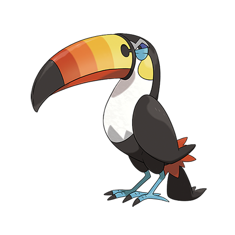

# Toucannon (#0733)

*Blade Quill Pokemon*

**Type:** Normale / Volante
**Abilities:** [[Keen Eye]], [[Skill Link]], [[Sheer Force]] *(Hidden)*
**Base HP:** 5

> It can store and expel an extremely hot gas through its beak that ignites easily. The berry seeds it shoots can pierce boulders, leaving perfectly round holes on them. Fortunately, they nest deep in the jungle.

---

## Statistiche (Attributes & Limits)

| Attribute | Base / Limit |
|---|---|
| **Strength** | 3/7 |
| **Dexterity** | 2/4 |
| **Vitality** | 2/5 |
| **Special** | 2/5 |
| **Insight** | 2/5 |

---

## Mosse (Learnset)

- **Starter:** [[Peck|Peck]], [[Growl|Growl]]
- **Beginner:** [[Echoed_Voice|Echoed Voice]], [[Rock_Smash|Rock Smash]]
- **Amateur:** [[Screech|Screech]], [[Rock_Blast|Rock Blast]], [[Supersonic|Supersonic]], [[Pluck|Pluck]], [[Roost|Roost]], [[Fury_Attack|Fury Attack]]
- **Ace:** [[Beak_Blast|Beak Blast]], [[Drill_Peck|Drill Peck]], [[Bullet_Seed|Bullet Seed]], [[Feather_Dance|Feather Dance]], [[Hyper_Voice|Hyper Voice]]
- **Pro:** [[Boomburst|Boomburst]], [[Tailwind|Tailwind]], [[Brave_Bird|Brave Bird]]

---

## Correlati

### Catena Evolutiva
- [[0731_Pikipek|Pikipek]]
- [[0732_Trumbeak|Trumbeak]]
- [[0733_Toucannon|Toucannon]]

