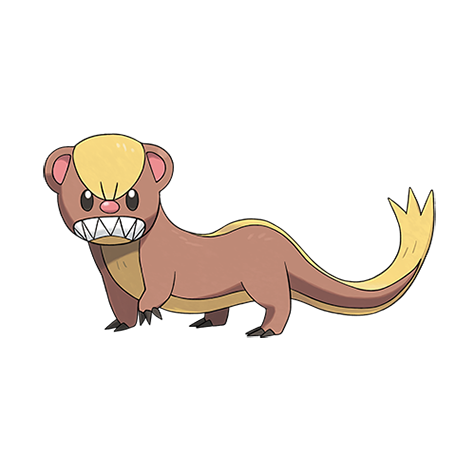

# Yungoos (#0734)

*Loitering Pokemon*

**Type:** Normale
**Abilities:** [[Stakeout]], [[Strong Jaw]], [[Adaptability]] *(Hidden)*
**Base HP:** 3

> This Pokemon was brought to Alola in an attempt to eradicate Ratatta. It spends all day searching for prey and it’s constantly hungry. when the sun sets it falls asleep right where it was standing.

---

## Statistiche (Attributes & Limits)

| Attribute | Base / Limit |
|---|---|
| **Strength** | 2/5 |
| **Dexterity** | 2/4 |
| **Vitality** | 1/3 |
| **Special** | 1/3 |
| **Insight** | 1/3 |

---

## Mosse (Learnset)

- **Starter:** [[Tackle|Tackle]], [[Leer|Leer]]
- **Beginner:** [[Pursuit|Pursuit]], [[Sand_Attack|Sand Attack]], [[Odor_Sleuth|Odor Sleuth]]
- **Amateur:** [[Bide|Bide]], [[Bite|Bite]], [[Mud_Slap|Mud Slap]], [[Super_Fang|Super Fang]], [[Take_Down|Take Down]], [[Scary_Face|Scary Face]], [[Yawn|Yawn]]
- **Ace:** [[Hyper_Fang|Hyper Fang]], [[Crunch|Crunch]], [[Thrash|Thrash]], [[Rest|Rest]]
- **Pro:** [[Revenge|Revenge]], [[Sleep_Talk|Sleep Talk]], [[Last_Resort|Last Resort]]

---

## Correlati

### Catena Evolutiva
- [[0734_Yungoos|Yungoos]]
- [[0735_Gumshoos|Gumshoos]]

