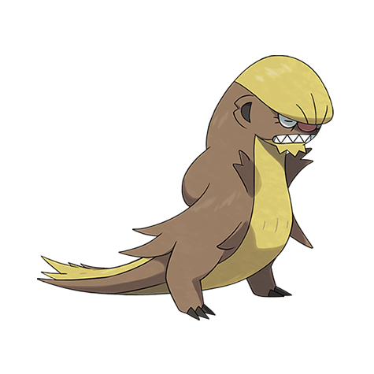

# Gumshoos (#0735)

*Stakeout Pokemon*

**Type:** Normale
**Abilities:** [[Stakeout]], [[Strong Jaw]], [[Adaptability]] *(Hidden)*
**Base HP:** 4

> Alolan Ratatta became nocturnal to evade this Pokemon, as it is their main Predator. Gumshoos now go hungry for days before they find something suitable to eat, they compensate by sleeping a lot.

---

## Statistiche (Attributes & Limits)

| Attribute | Base / Limit |
|---|---|
| **Strength** | 3/6 |
| **Dexterity** | 2/4 |
| **Vitality** | 2/4 |
| **Special** | 2/4 |
| **Insight** | 2/4 |

---

## Mosse (Learnset)

- **Starter:** [[Tackle|Tackle]], [[Leer|Leer]]
- **Beginner:** [[Pursuit|Pursuit]], [[Sand_Attack|Sand Attack]], [[Odor_Sleuth|Odor Sleuth]]
- **Amateur:** [[Bide|Bide]], [[Bite|Bite]], [[Mud_Slap|Mud Slap]], [[Super_Fang|Super Fang]], [[Take_Down|Take Down]], [[Scary_Face|Scary Face]], [[Yawn|Yawn]]
- **Ace:** [[Hyper_Fang|Hyper Fang]], [[Crunch|Crunch]], [[Thrash|Thrash]], [[Rest|Rest]]
- **Pro:** [[Revenge|Revenge]], [[Sleep_Talk|Sleep Talk]], [[Last_Resort|Last Resort]]

---

## Correlati

### Catena Evolutiva
- [[0734_Yungoos|Yungoos]]
- [[0735_Gumshoos|Gumshoos]]

