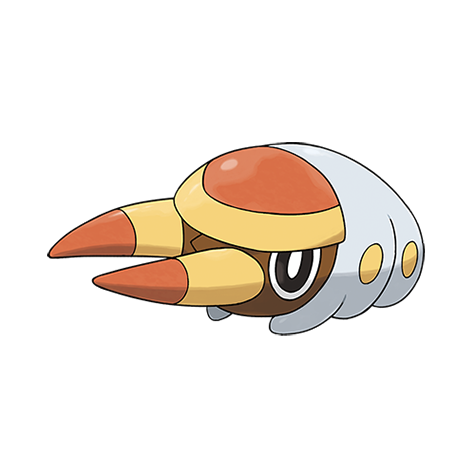

# Grubbin (#0736)

*Larva Pokemon*

**Type:** Insetto
**Abilities:** [[Swarm]]
**Base HP:** 3

> They tend to gather anywhere Electric Pokemon live to protect themselves from bird Pokemon who may prey on them. When they are ready to evolve they bury themselves underground.

---

## Statistiche (Attributes & Limits)

| Attribute | Base / Limit |
|---|---|
| **Strength** | 2/4 |
| **Dexterity** | 2/4 |
| **Vitality** | 2/4 |
| **Special** | 2/4 |
| **Insight** | 2/4 |

---

## Mosse (Learnset)

- **Starter:** [[Vice_Grip|Vice Grip]], [[String_Shot|String Shot]]
- **Beginner:** [[Mud_Slap|Mud Slap]], [[Bite|Bite]], [[Bug_Bite|Bug Bite]]
- **Amateur:** [[Spark|Spark]], [[Acrobatics|Acrobatics]], [[Crunch|Crunch]], [[Dig|Dig]]
- **Ace:** [[X_Scissor|X-Scissor]]
- **Pro:** [[Electroweb|Electroweb]], [[Harden|Harden]], [[Endure|Endure]]

---

## Correlati

### Catena Evolutiva
- [[0736_Grubbin|Grubbin]]
- [[0737_Charjabug|Charjabug]]
- [[0738_Vikavolt|Vikavolt]]

