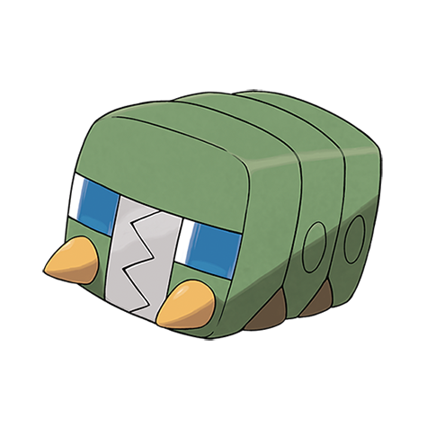

# Charjabug (#0737)

*Battery Pokemon*

**Type:** Insetto / Elettro
**Abilities:** [[Battery]]
**Base HP:** 4

> Whatever this Pokemon eats is transformed to electricity. People often use them to power up small appliances in their homes. This Pokemon rarely moves since it is preparing to evolve.

---

## Statistiche (Attributes & Limits)

| Attribute | Base / Limit |
|---|---|
| **Strength** | 2/5 |
| **Dexterity** | 1/3 |
| **Vitality** | 3/6 |
| **Special** | 2/4 |
| **Insight** | 2/5 |

---

## Mosse (Learnset)

- **Starter:** [[String_Shot|String Shot]], [[Vice_Grip|Vice Grip]]
- **Beginner:** [[Bite|Bite]], [[Mud_Slap|Mud Slap]], [[Bug_Bite|Bug Bite]]
- **Amateur:** [[Charge|Charge]], [[Spark|Spark]], [[Acrobatics|Acrobatics]], [[Crunch|Crunch]], [[Dig|Dig]]
- **Ace:** [[X_Scissor|X-Scissor]], [[Discharge|Discharge]], [[Iron_Defense|Iron Defense]]
- **Pro:** [[Endure|Endure]], [[Charge_Beam|Charge Beam]], [[Electroweb|Electroweb]]

---

## Correlati

### Catena Evolutiva
- [[0736_Grubbin|Grubbin]]
- [[0737_Charjabug|Charjabug]]
- [[0738_Vikavolt|Vikavolt]]

