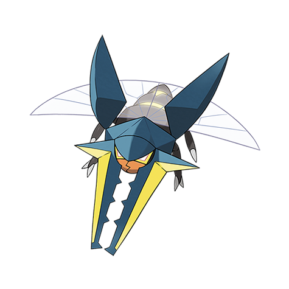

# Vikavolt (#0738)

*Stag Beetle Pokemon*

**Type:** Insetto / Elettro
**Abilities:** [[Levitate]]
**Base HP:** 5

> The electricity it shoots through its jaws is very dangerous, it zaps bird Pokemon trying to eat it. Its flight is peculiar, for it bends in a 90° angle or flies backwards without a problem.

---

## Statistiche (Attributes & Limits)

| Attribute | Base / Limit |
|---|---|
| **Strength** | 2/5 |
| **Dexterity** | 1/3 |
| **Vitality** | 2/5 |
| **Special** | 4/8 |
| **Insight** | 2/5 |

---

## Mosse (Learnset)

- **Starter:** [[String_Shot|String Shot]], [[Vice_Grip|Vice Grip]]
- **Beginner:** [[Bite|Bite]], [[Mud_Slap|Mud Slap]], [[Bug_Bite|Bug Bite]]
- **Amateur:** [[Thunderbolt|Thunderbolt]], [[Air_Slash|Air Slash]], [[Charge|Charge]], [[Spark|Spark]], [[Acrobatics|Acrobatics]], [[Dig|Dig]]
- **Ace:** [[Bug_Buzz|Bug Buzz]], [[Guillotine|Guillotine]], [[Zap_Cannon|Zap Cannon]], [[Agility|Agility]]
- **Pro:** [[Mud_Shot|Mud Shot]], [[Endure|Endure]], [[Charge_Beam|Charge Beam]]

---

## Correlati

### Catena Evolutiva
- [[0736_Grubbin|Grubbin]]
- [[0737_Charjabug|Charjabug]]
- [[0738_Vikavolt|Vikavolt]]

