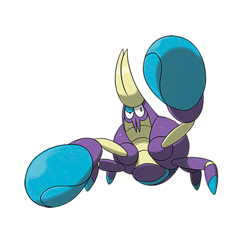

# Crabrawler (#0739)

*Boxing Pokemon*

**Type:** Lotta
**Abilities:** [[Hyper Cutter]], [[Iron Fist]], [[Anger Point]] *(Hidden)*
**Base HP:** 3

> They can be found on the beach, but as they grow stronger they also venture more into the land where they fight for ripe berries. They punch with their pincers, which are delicious with butter by the way.

---

## Statistiche (Attributes & Limits)

| Attribute | Base / Limit |
|---|---|
| **Strength** | 2/5 |
| **Dexterity** | 2/4 |
| **Vitality** | 2/4 |
| **Special** | 1/3 |
| **Insight** | 2/4 |

---

## Mosse (Learnset)

- **Starter:** [[Bubble|Bubble]], [[Leer|Leer]]
- **Beginner:** [[Rock_Smash|Rock Smash]], [[Pursuit|Pursuit]], [[Bubble_Beam|Bubble Beam]]
- **Amateur:** [[Power_Up_Punch|Power-Up Punch]], [[Dizzy_Punch|Dizzy Punch]], [[Payback|Payback]], [[Reversal|Reversal]], [[Crabhammer|Crabhammer]]
- **Ace:** [[Iron_Defense|Iron Defense]], [[Dynamic_Punch|Dynamic Punch]], [[Close_Combat|Close Combat]]
- **Pro:** [[Endeavor|Endeavor]], [[Superpower|Superpower]], [[Wide_Guard|Wide Guard]]

---

## Correlati

### Catena Evolutiva
- [[0739_Crabrawler|Crabrawler]]
- [[0740_Crabominable|Crabominable]]

