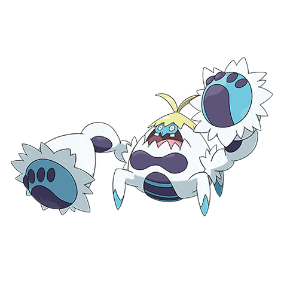

# Crabominable (#0740)

*Woolly Crab Pokemon*

**Type:** Lotta / Ghiaccio
**Abilities:** [[Hyper Cutter]], [[Iron Fist]], [[Anger Point]] *(Hidden)*
**Base HP:** 4

> Crawbrawlers who get lost in the snowy mountains of Alola are forced to evolve into a more suited form. Crabominables are not very smart and throw punches to friends and foes alike when they panic.

---

## Statistiche (Attributes & Limits)

| Attribute | Base / Limit |
|---|---|
| **Strength** | 3/7 |
| **Dexterity** | 2/4 |
| **Vitality** | 2/5 |
| **Special** | 2/4 |
| **Insight** | 2/4 |

---

## Mosse (Learnset)

- **Starter:** [[Leer|Leer]], [[Bubble|Bubble]]
- **Beginner:** [[Rock_Smash|Rock Smash]], [[Bubble_Beam|Bubble Beam]], [[Pursuit|Pursuit]]
- **Amateur:** [[Ice_Punch|Ice Punch]], [[Power_Up_Punch|Power-Up Punch]], [[Dizzy_Punch|Dizzy Punch]], [[Avalanche|Avalanche]], [[Reversal|Reversal]]
- **Ace:** [[Ice_Hammer|Ice Hammer]], [[Iron_Defense|Iron Defense]], [[Dynamic_Punch|Dynamic Punch]], [[Close_Combat|Close Combat]]
- **Pro:** [[Endeavor|Endeavor]], [[Wide_Guard|Wide Guard]], [[Superpower|Superpower]]

---

## Correlati

### Catena Evolutiva
- [[0739_Crabrawler|Crabrawler]]
- [[0740_Crabominable|Crabominable]]

