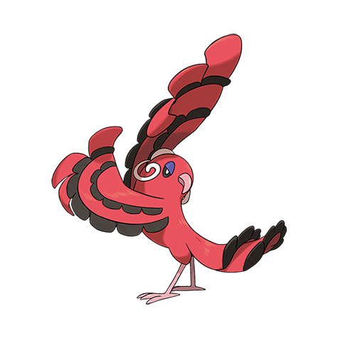

# Oricorio (#0741)

*Dancing Pokemon*

**Type:** Fuoco / Volante
**Abilities:** [[Dancer]]
**Base HP:** 4

> What was thought to be different species ended up being a single Pokemon. Oricorio Baile is an intense and passionate Pokemon, every flap of its wings produces embers, its fiery dance has inspired many.

---

## Statistiche (Attributes & Limits)

| Attribute | Base / Limit |
|---|---|
| **Strength** | 2/5 |
| **Dexterity** | 3/6 |
| **Vitality** | 2/5 |
| **Special** | 3/6 |
| **Insight** | 2/5 |

---

## Mosse (Learnset)

- **Starter:** [[Pound|Pound]], [[Growl|Growl]]
- **Beginner:** [[Peck|Peck]], [[Helping_Hand|Helping Hand]], [[Air_Cutter|Air Cutter]]
- **Amateur:** [[Baton_Pass|Baton Pass]], [[Feather_Dance|Feather Dance]], [[Double_Slap|Double Slap]], [[Teeter_Dance|Teeter Dance]], [[Roost|Roost]], [[Captivate|Captivate]], [[Air_Slash|Air Slash]]
- **Ace:** [[Revelation_Dance|Revelation Dance]], [[Mirror_Move|Mirror Move]], [[Agility|Agility]], [[Hurricane|Hurricane]]
- **Pro:** [[Swords_Dance|Swords Dance]], [[Attract|Attract]], [[Round|Round]]

---

## Correlati

### Catena Evolutiva
- [[0741_Oricorio|Oricorio]]
- Oricorio (Pom-pom Form)
- Oricorio (Pa'u Form)
- Oricorio (Sensu Form)

---

## Oricorio (Forma Pom-Pom) (#0741F1)

**Type:** Elettro / Volante
**Abilities:** [[Dancer]]
**Base HP:** 4

| Attribute | Base / Limit |
|---|---|
| **Strength** | 2/5 |
| **Dexterity** | 3/6 |
| **Vitality** | 2/5 |
| **Special** | 3/6 |
| **Insight** | 2/5 |

### Mosse

- **Starter:** [[Pound|Pound]], [[Growl|Growl]]
- **Beginner:** [[Peck|Peck]], [[Helping_Hand|Helping Hand]], [[Air_Cutter|Air Cutter]]
- **Amateur:** [[Baton_Pass|Baton Pass]], [[Feather_Dance|Feather Dance]], [[Double_Slap|Double Slap]], [[Teeter_Dance|Teeter Dance]], [[Roost|Roost]], [[Captivate|Captivate]], [[Air_Slash|Air Slash]]
- **Ace:** [[Revelation_Dance|Revelation Dance]], [[Mirror_Move|Mirror Move]], [[Agility|Agility]], [[Hurricane|Hurricane]]
- **Pro:** [[Swords_Dance|Swords Dance]], [[Attract|Attract]], [[Round|Round]]

---

## Oricorio (Forma Pa'u) (#0741F2)

**Type:** Psico / Volante
**Abilities:** [[Dancer]]
**Base HP:** 4

| Attribute | Base / Limit |
|---|---|
| **Strength** | 2/5 |
| **Dexterity** | 3/6 |
| **Vitality** | 2/5 |
| **Special** | 3/6 |
| **Insight** | 2/5 |

### Mosse

- **Starter:** [[Pound|Pound]], [[Growl|Growl]]
- **Beginner:** [[Peck|Peck]], [[Helping_Hand|Helping Hand]], [[Air_Cutter|Air Cutter]]
- **Amateur:** [[Baton_Pass|Baton Pass]], [[Feather_Dance|Feather Dance]], [[Double_Slap|Double Slap]], [[Teeter_Dance|Teeter Dance]], [[Roost|Roost]], [[Captivate|Captivate]], [[Air_Slash|Air Slash]]
- **Ace:** [[Revelation_Dance|Revelation Dance]], [[Mirror_Move|Mirror Move]], [[Agility|Agility]], [[Hurricane|Hurricane]]
- **Pro:** [[Swords_Dance|Swords Dance]], [[Attract|Attract]], [[Round|Round]]

---

## Oricorio (Forma Sensu) (#0741F3)

**Type:** Spettro / Volante
**Abilities:** [[Dancer]]
**Base HP:** 4

| Attribute | Base / Limit |
|---|---|
| **Strength** | 2/5 |
| **Dexterity** | 3/6 |
| **Vitality** | 2/5 |
| **Special** | 3/6 |
| **Insight** | 2/5 |

### Mosse

- **Starter:** [[Pound|Pound]], [[Growl|Growl]]
- **Beginner:** [[Peck|Peck]], [[Helping_Hand|Helping Hand]], [[Air_Cutter|Air Cutter]]
- **Amateur:** [[Baton_Pass|Baton Pass]], [[Feather_Dance|Feather Dance]], [[Double_Slap|Double Slap]], [[Teeter_Dance|Teeter Dance]], [[Roost|Roost]], [[Captivate|Captivate]], [[Air_Slash|Air Slash]]
- **Ace:** [[Revelation_Dance|Revelation Dance]], [[Mirror_Move|Mirror Move]], [[Agility|Agility]], [[Hurricane|Hurricane]]
- **Pro:** [[Swords_Dance|Swords Dance]], [[Attract|Attract]], [[Round|Round]]

