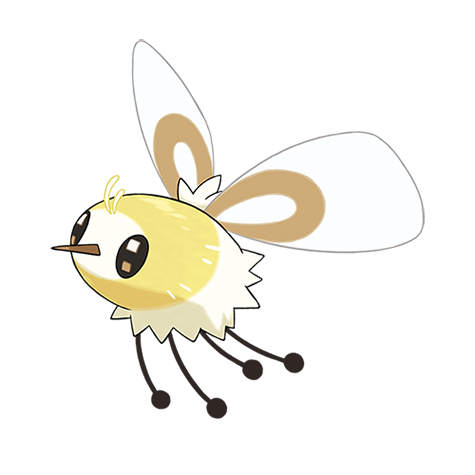

# Cutiefly (#0742)

*Bee Fly Pokemon*

**Type:** Insetto / Folletto
**Abilities:** [[Honey Gather]], [[Shield Dust]], [[Sweet Veil]] *(Hidden)*
**Base HP:** 3

> These delicate Pokemon gather by the numbers in flower meadows. They are attracted to happy and joyful people, the story says that Cutiefly see their auras and they resemble flowers.

---

## Statistiche (Attributes & Limits)

| Attribute | Base / Limit |
|---|---|
| **Strength** | 2/4 |
| **Dexterity** | 2/5 |
| **Vitality** | 1/3 |
| **Special** | 2/4 |
| **Insight** | 1/3 |

---

## Mosse (Learnset)

- **Starter:** [[Absorb|Absorb]]
- **Beginner:** [[Fairy_Wind|Fairy Wind]], [[Stun_Spore|Stun Spore]], [[Struggle_Bug|Struggle Bug]]
- **Amateur:** [[Silver_Wind|Silver Wind]], [[Draining_Kiss|Draining Kiss]], [[Sweet_Scent|Sweet Scent]], [[Bug_Buzz|Bug Buzz]]
- **Ace:** [[Dazzling_Gleam|Dazzling Gleam]], [[Aromatherapy|Aromatherapy]], [[Quiver_Dance|Quiver Dance]]
- **Pro:** [[Moonblast|Moonblast]], [[Baton_Pass|Baton Pass]], [[Speed_Swap|Speed Swap]]

---

## Correlati

### Catena Evolutiva
- [[0742_Cutiefly|Cutiefly]]
- [[0743_Ribombee|Ribombee]]

