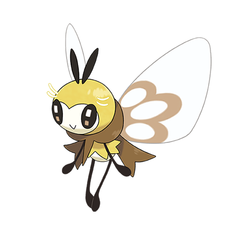

# Ribombee (#0743)

*Bee Fly Pokemon*

**Type:** Insetto / Folletto
**Abilities:** [[Honey Gather]], [[Shield Dust]], [[Sweet Veil]] *(Hidden)*
**Base HP:** 4

> The pollen puff of a happy Ribombee are very nutritious and valuable supplements in Alola. It dislikes rain, for it wets its hair and makes it unable to fly, so if you see a Ribombee you know the weather will be nice.

---

## Statistiche (Attributes & Limits)

| Attribute | Base / Limit |
|---|---|
| **Strength** | 2/4 |
| **Dexterity** | 3/7 |
| **Vitality** | 2/4 |
| **Special** | 3/6 |
| **Insight** | 2/5 |

---

## Mosse (Learnset)

- **Starter:** [[Absorb|Absorb]]
- **Beginner:** [[Struggle_Bug|Struggle Bug]], [[Fairy_Wind|Fairy Wind]], [[Stun_Spore|Stun Spore]]
- **Amateur:** [[Pollen_Puff|Pollen Puff]], [[Silver_Wind|Silver Wind]], [[Draining_Kiss|Draining Kiss]], [[Sweet_Scent|Sweet Scent]], [[Bug_Buzz|Bug Buzz]]
- **Ace:** [[Dazzling_Gleam|Dazzling Gleam]], [[Aromatherapy|Aromatherapy]], [[Quiver_Dance|Quiver Dance]]
- **Pro:** [[Moonblast|Moonblast]], [[Infestation|Infestation]], [[Skill_Swap|Skill Swap]]

---

## Correlati

### Catena Evolutiva
- [[0742_Cutiefly|Cutiefly]]
- [[0743_Ribombee|Ribombee]]

