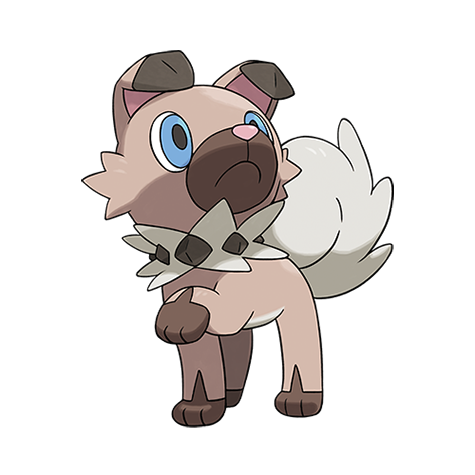

# Rockruff (#0744)

*Puppy Pokemon*

**Type:** Roccia
**Abilities:** [[Keen Eye]], [[Vital Spirit]], [[Steadfast]] *(Hidden)*
**Base HP:** 3

> Rockruff are very social and friendly, their keen sense of smell allows them to find their trainers easily. However, as they age they become wilder and rebellious. Do not let them roam alone at night.

---

## Statistiche (Attributes & Limits)

| Attribute | Base / Limit |
|---|---|
| **Strength** | 2/4 |
| **Dexterity** | 2/4 |
| **Vitality** | 1/3 |
| **Special** | 1/3 |
| **Insight** | 1/3 |

---

## Mosse (Learnset)

- **Starter:** [[Tackle|Tackle]], [[Leer|Leer]]
- **Beginner:** [[Sand_Attack|Sand Attack]], [[Bite|Bite]], [[Howl|Howl]]
- **Amateur:** [[Rock_Throw|Rock Throw]], [[Odor_Sleuth|Odor Sleuth]], [[Rock_Tomb|Rock Tomb]], [[Roar|Roar]], [[Stealth_Rock|Stealth Rock]], [[Scary_Face|Scary Face]]
- **Ace:** [[Rock_Slide|Rock Slide]], [[Crunch|Crunch]], [[Rock_Climb|Rock Climb]], [[Stone_Edge|Stone Edge]]
- **Pro:** [[Fire_Fang|Fire Fang]], [[Snarl|Snarl]], [[Thunder_Fang|Thunder Fang]]

---

## Correlati

### Catena Evolutiva
- [[0744_Rockruff|Rockruff]]
- Lycanroc (Midday Form)
- Lycanroc (Dusk Form)
- Lycanroc (Midnight Form)

