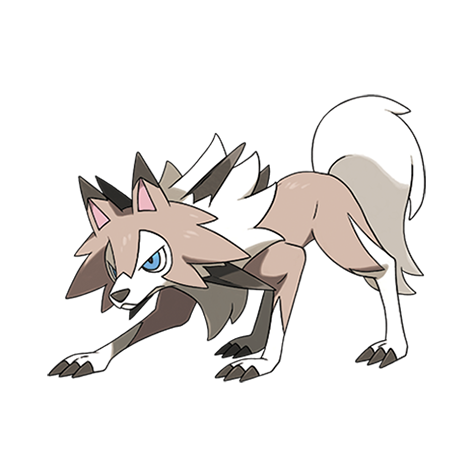

# Lycanroc (#0745)

*Wolf Pokemon*

**Type:** Roccia
**Abilities:** [[Keen Eye]], [[Sand Rush]], [[Steadfast]] *(Hidden)*
**Base HP:** 4

> A well-disciplined Rockruff will evolve at Dawn. This Pokemon is very Loyal and trustworthy. It can climb mountains fast and is a quick runner. The rocks on its mane are its main weapons.

---

## Statistiche (Attributes & Limits)

| Attribute | Base / Limit |
|---|---|
| **Strength** | 3/6 |
| **Dexterity** | 3/6 |
| **Vitality** | 2/4 |
| **Special** | 2/4 |
| **Insight** | 2/4 |

---

## Mosse (Learnset)

- **Starter:** [[Quick_Attack|Quick Attack]], [[Tackle|Tackle]], [[Leer|Leer]]
- **Beginner:** [[Sand_Attack|Sand Attack]], [[Bite|Bite]], [[Howl|Howl]]
- **Amateur:** [[Accelerock|Accelerock]], [[Quick_Guard|Quick Guard]], [[Rock_Throw|Rock Throw]], [[Odor_Sleuth|Odor Sleuth]], [[Rock_Tomb|Rock Tomb]], [[Roar|Roar]], [[Stealth_Rock|Stealth Rock]], [[Scary_Face|Scary Face]]
- **Ace:** [[Rock_Slide|Rock Slide]], [[Crunch|Crunch]], [[Rock_Climb|Rock Climb]], [[Stone_Edge|Stone Edge]]
- **Pro:** [[Rock_Polish|Rock Polish]], [[Iron_Defense|Iron Defense]], [[Drill_Run|Drill Run]]

---

---

## Lycanroc (Forma Mezzanotte) (#0745F1)

**Type:** Roccia
**Abilities:** [[Keen Eye]], [[Vital Spirit]], [[No Guard]] *(Hidden)*
**Base HP:** 4

| Attribute | Base / Limit |
|---|---|
| **Strength** | 3/6 |
| **Dexterity** | 2/5 |
| **Vitality** | 2/5 |
| **Special** | 2/4 |
| **Insight** | 2/5 |

### Mosse

- **Starter:** [[Taunt|Taunt]], [[Tackle|Tackle]], [[Leer|Leer]]
- **Beginner:** [[Sand_Attack|Sand Attack]], [[Bite|Bite]], [[Howl|Howl]]
- **Amateur:** [[Counter|Counter]], [[Reversal|Reversal]], [[Rock_Throw|Rock Throw]], [[Odor_Sleuth|Odor Sleuth]], [[Rock_Tomb|Rock Tomb]], [[Roar|Roar]], [[Stealth_Rock|Stealth Rock]], [[Scary_Face|Scary Face]]
- **Ace:** [[Rock_Slide|Rock Slide]], [[Crunch|Crunch]], [[Rock_Climb|Rock Climb]], [[Stone_Edge|Stone Edge]]
- **Pro:** [[Outrage|Outrage]], [[Throat_Chop|Throat Chop]], [[Bulk_Up|Bulk Up]]

---

## Lycanroc (Forma Crepuscolo) (#0745F2)

**Type:** Roccia
**Abilities:** [[Tough Claws]]
**Base HP:** 4

| Attribute | Base / Limit |
|---|---|
| **Strength** | 3/6 |
| **Dexterity** | 3/6 |
| **Vitality** | 2/4 |
| **Special** | 2/4 |
| **Insight** | 2/4 |

### Mosse

- **Starter:** [[Leer|Leer]], [[Tackle|Tackle]]
- **Beginner:** [[Bite|Bite]], [[Sand_Attack|Sand Attack]], [[Howl|Howl]]
- **Amateur:** [[Counter|Counter]], [[Accelerock|Accelerock]], [[Scary_Face|Scary Face]], [[Rock_Throw|Rock Throw]], [[Odor_Sleuth|Odor Sleuth]], [[Rock_Tomb|Rock Tomb]], [[Roar|Roar]], [[Stealth_Rock|Stealth Rock]]
- **Ace:** [[Rock_Slide|Rock Slide]], [[Thrash|Thrash]], [[Crunch|Crunch]], [[Rock_Climb|Rock Climb]], [[Stone_Edge|Stone Edge]]
- **Pro:** [[Outrage|Outrage]], [[Iron_Head|Iron Head]], [[Drill_Run|Drill Run]]

