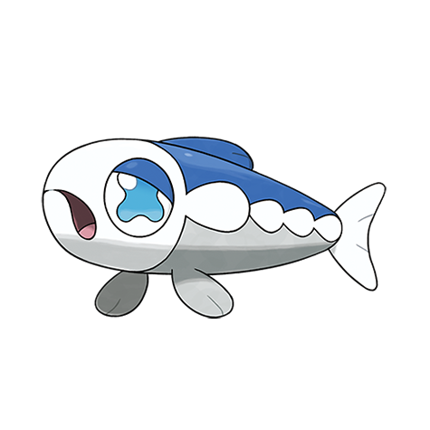

# Wishiwashi (#0746)

*Small Fry Pokemon*

**Type:** Acqua
**Abilities:** [[Schooling]]
**Base HP:** 4

> People and Pokemon enjoy this tiny Pokemon's meat. Their eyes shine as a distress signal, other members of its species will travel far and wide to attend the call for help. When this happens you must run.

---

## Statistiche (Attributes & Limits)

| Attribute | Base / Limit |
|---|---|
| **Strength** | 1/3 |
| **Dexterity** | 2/4 |
| **Vitality** | 1/3 |
| **Special** | 1/3 |
| **Insight** | 1/3 |

---

## Mosse (Learnset)

- **Starter:** [[Water_Gun|Water Gun]], [[Growl|Growl]]
- **Beginner:** [[Helping_Hand|Helping Hand]], [[Feint_Attack|Feint Attack]], [[Brine|Brine]]
- **Amateur:** [[Aqua_Ring|Aqua Ring]], [[Tearful_Look|Tearful Look]], [[Take_Down|Take Down]], [[Dive|Dive]], [[Beat_Up|Beat Up]], [[Aqua_Tail|Aqua Tail]], [[Soak|Soak]]
- **Ace:** [[Double_Edge|Double-Edge]], [[Endeavor|Endeavor]], [[Hydro_Pump|Hydro Pump]]
- **Pro:** [[Muddy_Water|Muddy Water]], [[Mist|Mist]], [[Water_Pulse|Water Pulse]]

---

## Correlati

### Catena Evolutiva
- [[0746_Wishiwashi|Wishiwashi]]
- Wishiwashi (Swarm Form)

---

## Wishiwashi (Forma Sciame) (#0746F1)

**Type:** Acqua
**Abilities:** [[Schooling]]
**Base HP:** 8

| Attribute | Base / Limit |
|---|---|
| **Strength** | 3/7 |
| **Dexterity** | 1/3 |
| **Vitality** | 3/7 |
| **Special** | 3/7 |
| **Insight** | 3/7 |

### Mosse

- **Starter:** [[Water_Gun|Water Gun]], [[Growl|Growl]]
- **Beginner:** [[Helping_Hand|Helping Hand]], [[Feint_Attack|Feint Attack]], [[Brine|Brine]]
- **Amateur:** [[Aqua_Ring|Aqua Ring]], [[Tearful_Look|Tearful Look]], [[Take_Down|Take Down]], [[Dive|Dive]], [[Beat_Up|Beat Up]], [[Aqua_Tail|Aqua Tail]], [[Soak|Soak]]
- **Ace:** [[Double_Edge|Double-Edge]], [[Endeavor|Endeavor]], [[Hydro_Pump|Hydro Pump]]
- **Pro:** [[Muddy_Water|Muddy Water]], [[Mist|Mist]], [[Water_Pulse|Water Pulse]]

