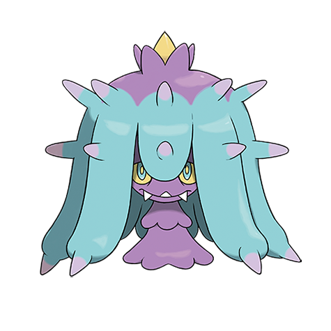

# Mareanie (#0747)

*Brutal Star Pokemon*

**Type:** Veleno / Acqua
**Abilities:** [[Merciless]], [[Limber]], [[Regenerator]] *(Hidden)*
**Base HP:** 3

> It can be found resting on the sea floor, waiting for an unsuspecting prey to sting. They are pretty toxic and attack with their ten barbed tentacles. Corsolas are one of its favorite meals.

---

## Statistiche (Attributes & Limits)

| Attribute | Base / Limit |
|---|---|
| **Strength** | 2/4 |
| **Dexterity** | 2/4 |
| **Vitality** | 2/4 |
| **Special** | 1/3 |
| **Insight** | 2/4 |

---

## Mosse (Learnset)

- **Starter:** [[Poison_Sting|Poison Sting]], [[Peck|Peck]]
- **Beginner:** [[Bite|Bite]], [[Toxic_Spikes|Toxic Spikes]], [[Wide_Guard|Wide Guard]]
- **Amateur:** [[Toxic|Toxic]], [[Venoshock|Venoshock]], [[Spike_Cannon|Spike Cannon]], [[Pin_Missile|Pin Missile]], [[Poison_Jab|Poison Jab]]
- **Ace:** [[Venom_Drench|Venom Drench]], [[Recover|Recover]], [[Liquidation|Liquidation]]
- **Pro:** [[Protect|Protect]], [[Stockpile|Stockpile]], [[Sludge_Bomb|Sludge Bomb]]

---

## Correlati

### Catena Evolutiva
- [[0747_Mareanie|Mareanie]]
- [[0748_Toxapex|Toxapex]]

