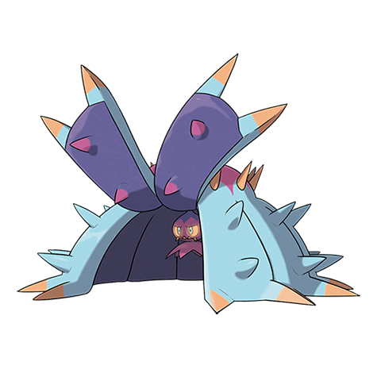

# Toxapex (#0748)

*Brutal Star Pokemon*

**Type:** Veleno / Acqua
**Abilities:** [[Merciless]], [[Limber]], [[Regenerator]] *(Hidden)*
**Base HP:** 4

> It crawls through the ocean floor, using its tentacles as a fortress. Its venom has the victim suffering for three days and nights, and even if it’s healed there are aftereffects for it is a powerful toxin.

---

## Statistiche (Attributes & Limits)

| Attribute | Base / Limit |
|---|---|
| **Strength** | 2/4 |
| **Dexterity** | 1/3 |
| **Vitality** | 3/7 |
| **Special** | 2/4 |
| **Insight** | 3/6 |

---

## Mosse (Learnset)

- **Starter:** [[Peck|Peck]], [[Poison_Sting|Poison Sting]]
- **Beginner:** [[Toxic_Spikes|Toxic Spikes]], [[Bite|Bite]], [[Wide_Guard|Wide Guard]]
- **Amateur:** [[Baneful_Bunker|Baneful Bunker]], [[Toxic|Toxic]], [[Venoshock|Venoshock]], [[Spike_Cannon|Spike Cannon]], [[Pin_Missile|Pin Missile]], [[Poison_Jab|Poison Jab]]
- **Ace:** [[Venom_Drench|Venom Drench]], [[Recover|Recover]], [[Liquidation|Liquidation]]
- **Pro:** [[Swallow|Swallow]], [[Stockpile|Stockpile]], [[Spit_Up|Spit Up]]

---

## Correlati

### Catena Evolutiva
- [[0747_Mareanie|Mareanie]]
- [[0748_Toxapex|Toxapex]]

