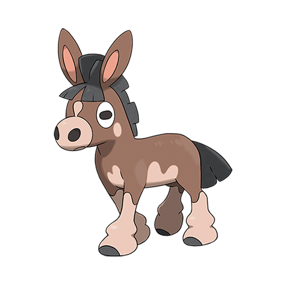

# Mudbray (#0749)

*Donkey Pokemon*

**Type:** Terra
**Abilities:** [[Own Tempo]], [[Stamina]], [[Inner Focus]] *(Hidden)*
**Base HP:** 3

> They are very strong, the mud on their hooves serves them as grip to pull themselves forward. They enjoy prancing in muddy places and will become stubborn and disobedient if denied that pleasure.

---

## Statistiche (Attributes & Limits)

| Attribute | Base / Limit |
|---|---|
| **Strength** | 3/6 |
| **Dexterity** | 2/4 |
| **Vitality** | 2/5 |
| **Special** | 2/4 |
| **Insight** | 2/4 |

---

## Mosse (Learnset)

- **Starter:** [[Mud_Slap|Mud Slap]], [[Mud_Sport|Mud Sport]]
- **Beginner:** [[Rototiller|Rototiller]], [[Bulldoze|Bulldoze]], [[Double_Kick|Double Kick]]
- **Amateur:** [[Stomp|Stomp]], [[Bide|Bide]], [[High_Horsepower|High Horsepower]], [[Iron_Defense|Iron Defense]], [[Heavy_Slam|Heavy Slam]], [[Counter|Counter]]
- **Ace:** [[Earthquake|Earthquake]], [[Mega_Kick|Mega Kick]], [[Superpower|Superpower]]
- **Pro:** [[Magnitude|Magnitude]], [[Strength|Strength]], [[Mud_Bomb|Mud Bomb]]

---

## Correlati

### Catena Evolutiva
- [[0749_Mudbray|Mudbray]]
- [[0750_Mudsdale|Mudsdale]]

