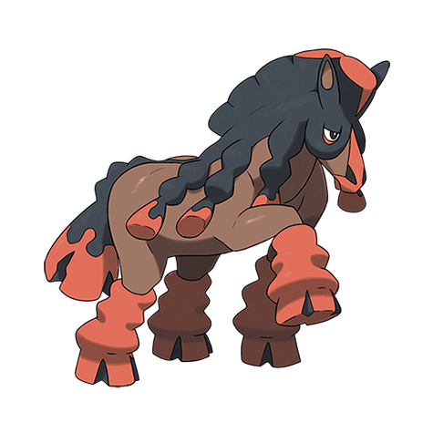

# Mudsdale (#0750)

*Draft Horse Pokemon*

**Type:** Terra
**Abilities:** [[Own Tempo]], [[Stamina]], [[Inner Focus]] *(Hidden)*
**Base HP:** 5

> Hard tempered and resilient. The hooves of this Pokemon stomp through concrete, while it is not very fast it can keep a steady pace for days, even when dragging weight.

---

## Statistiche (Attributes & Limits)

| Attribute | Base / Limit |
|---|---|
| **Strength** | 3/7 |
| **Dexterity** | 1/3 |
| **Vitality** | 3/6 |
| **Special** | 2/4 |
| **Insight** | 2/5 |

---

## Mosse (Learnset)

- **Starter:** [[Mud_Slap|Mud Slap]], [[Mud_Sport|Mud Sport]]
- **Beginner:** [[Rototiller|Rototiller]], [[Bulldoze|Bulldoze]], [[Double_Kick|Double Kick]]
- **Amateur:** [[Stomp|Stomp]], [[Bide|Bide]], [[High_Horsepower|High Horsepower]], [[Iron_Defense|Iron Defense]], [[Heavy_Slam|Heavy Slam]], [[Counter|Counter]]
- **Ace:** [[Earthquake|Earthquake]], [[Mega_Kick|Mega Kick]], [[Superpower|Superpower]]
- **Pro:** [[Rock_Slide|Rock Slide]], [[Giga_Impact|Giga Impact]], [[Close_Combat|Close Combat]]

---

## Correlati

### Catena Evolutiva
- [[0749_Mudbray|Mudbray]]
- [[0750_Mudsdale|Mudsdale]]

