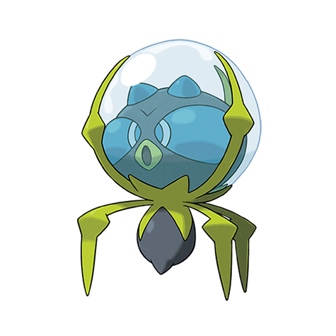

# Dewpider (#0751)

*Water Bubble Pokemon*

**Type:** Acqua / Insetto
**Abilities:** [[Water Bubble]], [[Water Absorb]] *(Hidden)*
**Base HP:** 3

> It lives on shallow water pools, but goes into the land to find prey. Its water bubble allows it to breath outside of its pool and serves as a weapon to hunt or defend itself. As it grows its bubble grows as well.

---

## Statistiche (Attributes & Limits)

| Attribute | Base / Limit |
|---|---|
| **Strength** | 1/3 |
| **Dexterity** | 1/3 |
| **Vitality** | 2/4 |
| **Special** | 1/3 |
| **Insight** | 2/5 |

---

## Mosse (Learnset)

- **Starter:** [[Water_Sport|Water Sport]], [[Bubble|Bubble]]
- **Beginner:** [[Infestation|Infestation]], [[Spider_Web|Spider Web]], [[Bug_Bite|Bug Bite]]
- **Amateur:** [[Bubble_Beam|Bubble Beam]], [[Bite|Bite]], [[Aqua_Ring|Aqua Ring]], [[Leech_Life|Leech Life]], [[Mirror_Coat|Mirror Coat]], [[Lunge|Lunge]]
- **Ace:** [[Crunch|Crunch]], [[Liquidation|Liquidation]], [[Entrainment|Entrainment]]
- **Pro:** [[Stockpile|Stockpile]], [[Aurora_Beam|Aurora Beam]], [[Spit_Up|Spit Up]]

---

## Correlati

### Catena Evolutiva
- [[0751_Dewpider|Dewpider]]
- [[0752_Araquanid|Araquanid]]

