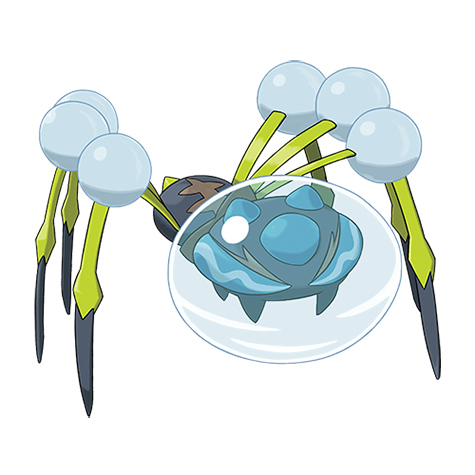

# Araquanid (#0752)

*Water Bubble Pokemon*

**Type:** Acqua / Insetto
**Abilities:** [[Water Bubble]], [[Water Absorb]] *(Hidden)*
**Base HP:** 4

> It’s debated whether this is a caring or cruel Pokemon. It looks around for any vulnerable or weak pokemon, tenderly carries them and deposits them into its water bubble where they end up drowning.

---

## Statistiche (Attributes & Limits)

| Attribute | Base / Limit |
|---|---|
| **Strength** | 2/5 |
| **Dexterity** | 1/3 |
| **Vitality** | 3/6 |
| **Special** | 2/4 |
| **Insight** | 3/7 |

---

## Mosse (Learnset)

- **Starter:** [[Water_Sport|Water Sport]], [[Bubble|Bubble]]
- **Beginner:** [[Infestation|Infestation]], [[Spider_Web|Spider Web]], [[Bug_Bite|Bug Bite]]
- **Amateur:** [[Soak|Soak]], [[Wide_Guard|Wide Guard]], [[Bubble_Beam|Bubble Beam]], [[Bite|Bite]], [[Aqua_Ring|Aqua Ring]], [[Leech_Life|Leech Life]], [[Mirror_Coat|Mirror Coat]], [[Lunge|Lunge]]
- **Ace:** [[Crunch|Crunch]], [[Liquidation|Liquidation]], [[Entrainment|Entrainment]]
- **Pro:** [[Power_Split|Power Split]], [[Attract|Attract]], [[Scald|Scald]]

---

## Correlati

### Catena Evolutiva
- [[0751_Dewpider|Dewpider]]
- [[0752_Araquanid|Araquanid]]

