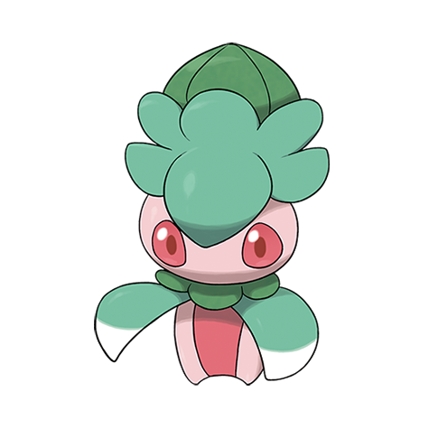

# Fomantis (#0753)

*Sickle Grass Pokemon*

**Type:** Erba
**Abilities:** [[Leaf Guard]], [[Contrary]] *(Hidden)*
**Base HP:** 3

> They sleep during the day, absorbing sunlight in a flower meadow; by night they become active and search for another spot to sleep. Their arms are made or sharp grass leaves to defend themselves.

---

## Statistiche (Attributes & Limits)

| Attribute | Base / Limit |
|---|---|
| **Strength** | 2/4 |
| **Dexterity** | 1/3 |
| **Vitality** | 1/3 |
| **Special** | 2/4 |
| **Insight** | 1/3 |

---

## Mosse (Learnset)

- **Starter:** [[Fury_Cutter|Fury Cutter]], [[Leafage|Leafage]]
- **Beginner:** [[Razor_Leaf|Razor Leaf]], [[Growth|Growth]]
- **Amateur:** [[Ingrain|Ingrain]], [[Leaf_Blade|Leaf Blade]], [[Synthesis|Synthesis]], [[Slash|Slash]], [[Sweet_Scent|Sweet Scent]]
- **Ace:** [[Solar_Beam|Solar Beam]], [[Sunny_Day|Sunny Day]]
- **Pro:** [[Weather_Ball|Weather Ball]], [[Giga_Drain|Giga Drain]], [[Aromatherapy|Aromatherapy]]

---

## Correlati

### Catena Evolutiva
- [[0753_Fomantis|Fomantis]]
- [[0754_Lurantis|Lurantis]]

