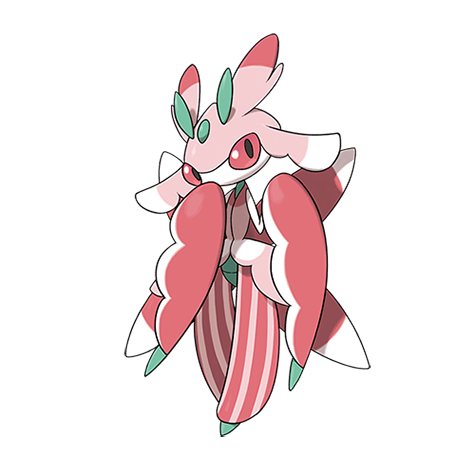

# Lurantis (#0754)

*Bloom Sickle Pokemon*

**Type:** Erba
**Abilities:** [[Leaf Guard]], [[Contrary]] *(Hidden)*
**Base HP:** 4

> Considered to be one of the mos beautiful Grass Pokemon due to its lovely coloration. They require a lot of maintenance and constant grooming, so they’ll only trust a Trainer who is up to the job.

---

## Statistiche (Attributes & Limits)

| Attribute | Base / Limit |
|---|---|
| **Strength** | 3/6 |
| **Dexterity** | 2/4 |
| **Vitality** | 2/5 |
| **Special** | 2/5 |
| **Insight** | 2/5 |

---

## Mosse (Learnset)

- **Starter:** [[Fury_Cutter|Fury Cutter]], [[Leafage|Leafage]]
- **Beginner:** [[Razor_Leaf|Razor Leaf]], [[Growth|Growth]]
- **Amateur:** [[Sweet_Scent|Sweet Scent]], [[Slash|Slash]], [[Ingrain|Ingrain]], [[Leaf_Blade|Leaf Blade]], [[Synthesis|Synthesis]]
- **Ace:** [[X_Scissor|X-Scissor]], [[Petal_Blizzard|Petal Blizzard]], [[Solar_Blade|Solar Blade]], [[Sunny_Day|Sunny Day]]
- **Pro:** [[Swords_Dance|Swords Dance]], [[Leaf_Storm|Leaf Storm]], [[Brick_Break|Brick Break]]

---

## Correlati

### Catena Evolutiva
- [[0753_Fomantis|Fomantis]]
- [[0754_Lurantis|Lurantis]]

