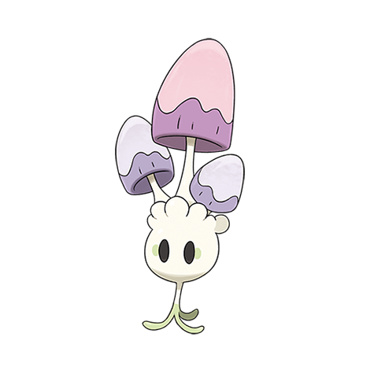

# Morelull (#0755)

*Illuminating Pokemon*

**Type:** Erba / Folletto
**Abilities:** [[Illuminate]], [[Effect Spore]], [[Rain Dish]] *(Hidden)*
**Base HP:** 3

> Morellul are nocturnal Pokemon whose headbulbs emit a faint glow. They root into a tree and use its nutrients to power their light, when the tree is all dried up they are ready to evolve.

---

## Statistiche (Attributes & Limits)

| Attribute | Base / Limit |
|---|---|
| **Strength** | 1/3 |
| **Dexterity** | 1/2 |
| **Vitality** | 2/4 |
| **Special** | 2/4 |
| **Insight** | 2/5 |

---

## Mosse (Learnset)

- **Starter:** [[Absorb|Absorb]], [[Astonish|Astonish]], [[Flash|Flash]]
- **Beginner:** [[Moonlight|Moonlight]], [[Mega_Drain|Mega Drain]], [[Sleep_Powder|Sleep Powder]]
- **Amateur:** [[Ingrain|Ingrain]], [[Confuse_Ray|Confuse Ray]], [[Giga_Drain|Giga Drain]], [[Strength_Sap|Strength Sap]], [[Dream_Eater|Dream Eater]], [[Spotlight|Spotlight]]
- **Ace:** [[Spore|Spore]], [[Moonblast|Moonblast]]
- **Pro:** [[Leech_Seed|Leech Seed]], [[Amnesia|Amnesia]], [[Light_Screen|Light Screen]]

---

## Correlati

### Catena Evolutiva
- [[0755_Morelull|Morelull]]
- [[0756_Shiinotic|Shiinotic]]

