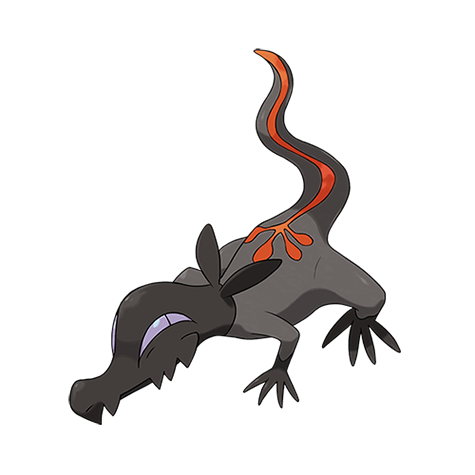

# Salandit (#0757)

*Toxic Lizard Pokemon*

**Type:** Veleno / Fuoco
**Abilities:** [[Corrosion]], [[Oblivious]] *(Hidden)*
**Base HP:** 3

> The markings at the end of its tail emit flames and a toxic gas, be careful as this gas smells sweet and specially appealing for the males of any species. Only female Salandit are known to evolve.

---

## Statistiche (Attributes & Limits)

| Attribute | Base / Limit |
|---|---|
| **Strength** | 1/3 |
| **Dexterity** | 2/5 |
| **Vitality** | 1/3 |
| **Special** | 2/5 |
| **Insight** | 2/4 |

---

## Mosse (Learnset)

- **Starter:** [[Scratch|Scratch]], [[Poison_Gas|Poison Gas]], [[Ember|Ember]]
- **Beginner:** [[Sweet_Scent|Sweet Scent]], [[Dragon_Rage|Dragon Rage]], [[Smog|Smog]]
- **Amateur:** [[Double_Slap|Double Slap]], [[Flame_Burst|Flame Burst]], [[Toxic|Toxic]], [[Nasty_Plot|Nasty Plot]], [[Venoshock|Venoshock]]
- **Ace:** [[Flamethrower|Flamethrower]], [[Venom_Drench|Venom Drench]], [[Dragon_Pulse|Dragon Pulse]]
- **Pro:** [[Attract|Attract]], [[Fake_Out|Fake Out]], [[Will_O_Wisp|Will-O-Wisp]]

---

## Correlati

### Catena Evolutiva
- [[0757_Salandit|Salandit]]
- [[0758_Salazzle|Salazzle]]

