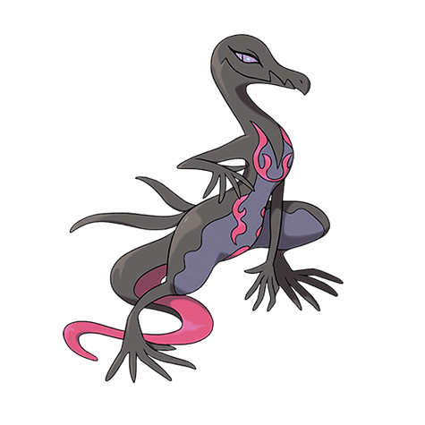

# Salazzle (#0758)

*Toxic Lizard Pokemon*

**Type:** Veleno / Fuoco
**Abilities:** [[Corrosion]], [[Oblivious]] *(Hidden)*
**Base HP:** 4

> This Pokemon is Female only. It releases a powerful toxic gas that is filled with pheromones that help her keep her reverse harem of Salandit in check. This gas can be purified into expensive perfumes.

---

## Statistiche (Attributes & Limits)

| Attribute | Base / Limit |
|---|---|
| **Strength** | 2/4 |
| **Dexterity** | 3/6 |
| **Vitality** | 2/4 |
| **Special** | 3/6 |
| **Insight** | 2/4 |

---

## Mosse (Learnset)

- **Starter:** [[Poison_Gas|Poison Gas]], [[Pound|Pound]], [[Ember|Ember]]
- **Beginner:** [[Sweet_Scent|Sweet Scent]], [[Dragon_Rage|Dragon Rage]], [[Smog|Smog]]
- **Amateur:** [[Nasty_Plot|Nasty Plot]], [[Venoshock|Venoshock]], [[Captivate|Captivate]], [[Torment|Torment]], [[Swagger|Swagger]], [[Double_Slap|Double Slap]], [[Flame_Burst|Flame Burst]], [[Toxic|Toxic]]
- **Ace:** [[Encore|Encore]], [[Disable|Disable]], [[Flamethrower|Flamethrower]], [[Venom_Drench|Venom Drench]], [[Dragon_Pulse|Dragon Pulse]]
- **Pro:** [[Attract|Attract]], [[Dragon_Tail|Dragon Tail]], [[Overheat|Overheat]]

---

## Correlati

### Catena Evolutiva
- [[0757_Salandit|Salandit]]
- [[0758_Salazzle|Salazzle]]

