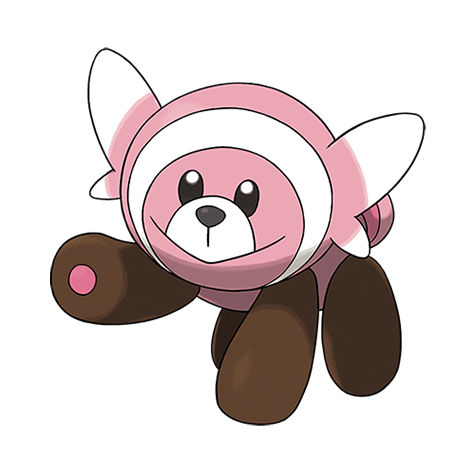

# Stufful (#0759)

*Flailing Pokemon*

**Type:** Normale / Lotta
**Abilities:** [[Fluffy]], [[Klutz]], [[Cute Charm]] *(Hidden)*
**Base HP:** 3

> Despite its adorable appearance it is a dangerous Pokemon. If anyone but its mother or Trainer touches it, it will respond by angrily flailing its arms around. They are popular pets but owners always regret.

---

## Statistiche (Attributes & Limits)

| Attribute | Base / Limit |
|---|---|
| **Strength** | 2/5 |
| **Dexterity** | 2/4 |
| **Vitality** | 2/4 |
| **Special** | 2/4 |
| **Insight** | 2/4 |

---

## Mosse (Learnset)

- **Starter:** [[Tackle|Tackle]], [[Leer|Leer]]
- **Beginner:** [[Bide|Bide]], [[Baby_Doll_Eyes|Baby-Doll Eyes]], [[Brutal_Swing|Brutal Swing]], [[Take_Down|Take Down]]
- **Amateur:** [[Payback|Payback]], [[Flail|Flail]], [[Hammer_Arm|Hammer Arm]], [[Pain_Split|Pain Split]]
- **Ace:** [[Thrash|Thrash]], [[Double_Edge|Double-Edge]], [[Superpower|Superpower]]
- **Pro:** [[Stomping_Tantrum|Stomping Tantrum]], [[Thunder_Punch|Thunder Punch]], [[Ice_Punch|Ice Punch]]

---

## Correlati

### Catena Evolutiva
- [[0759_Stufful|Stufful]]
- [[0760_Bewear|Bewear]]

