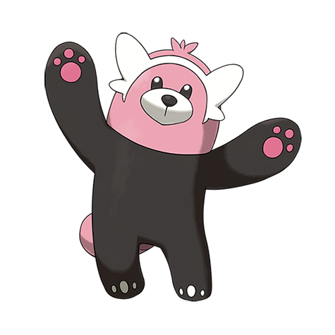

# Bewear (#0760)

*Strong Arm Pokemon*

**Type:** Normale / Lotta
**Abilities:** [[Fluffy]], [[Klutz]], [[Unnerve]] *(Hidden)*
**Base HP:** 6

> They may look friendly but their brute strength makes them very dangerous. Many Trainers have been severely injured and even snapped in half by the “hugs” of a Bewear.

---

## Statistiche (Attributes & Limits)

| Attribute | Base / Limit |
|---|---|
| **Strength** | 3/7 |
| **Dexterity** | 2/4 |
| **Vitality** | 2/5 |
| **Special** | 2/4 |
| **Insight** | 2/4 |

---

## Mosse (Learnset)

- **Starter:** [[Leer|Leer]], [[Tackle|Tackle]]
- **Beginner:** [[Baby_Doll_Eyes|Baby-Doll Eyes]], [[Bide|Bide]], [[Take_Down|Take Down]], [[Brutal_Swing|Brutal Swing]]
- **Amateur:** [[Flail|Flail]], [[Payback|Payback]], [[Bind|Bind]], [[Hammer_Arm|Hammer Arm]], [[Pain_Split|Pain Split]]
- **Ace:** [[Thrash|Thrash]], [[Double_Edge|Double-Edge]], [[Superpower|Superpower]]
- **Pro:** [[Wide_Guard|Wide Guard]], [[Dragon_Claw|Dragon Claw]], [[Giga_Impact|Giga Impact]]

---

## Correlati

### Catena Evolutiva
- [[0759_Stufful|Stufful]]
- [[0760_Bewear|Bewear]]

