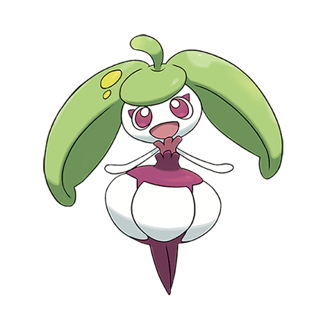

# Steenee (#0762)

*Fruit Pokemon*

**Type:** Erba
**Abilities:** [[Leaf Guard]], [[Oblivious]], [[Sweet Veil]] *(Hidden)*
**Base HP:** 4

> Its sweet aroma keeps attracting predators but it fends them away with its hard and bitter head leaves. It likes to be taken seriously and can be hard to deal with, if you make it mad you’ll receive a kick.

---

## Statistiche (Attributes & Limits)

| Attribute | Base / Limit |
|---|---|
| **Strength** | 1/3 |
| **Dexterity** | 2/4 |
| **Vitality** | 2/4 |
| **Special** | 1/3 |
| **Insight** | 2/4 |

---

## Mosse (Learnset)

- **Starter:** [[Play_Nice|Play Nice]], [[Splash|Splash]]
- **Beginner:** [[Sweet_Scent|Sweet Scent]], [[Rapid_Spin|Rapid Spin]], [[Razor_Leaf|Razor Leaf]]
- **Amateur:** [[Double_Slap|Double Slap]], [[Magical_Leaf|Magical Leaf]], [[Teeter_Dance|Teeter Dance]], [[Stomp|Stomp]], [[Aromatic_Mist|Aromatic Mist]], [[Captivate|Captivate]]
- **Ace:** [[Aromatherapy|Aromatherapy]], [[Leaf_Storm|Leaf Storm]]
- **Pro:** [[Acupressure|Acupressure]], [[Feint|Feint]], [[Synthesis|Synthesis]]

---

## Correlati

### Catena Evolutiva
- [[0761_Bounsweet|Bounsweet]]
- [[0762_Steenee|Steenee]]
- [[0763_Tsareena|Tsareena]]

