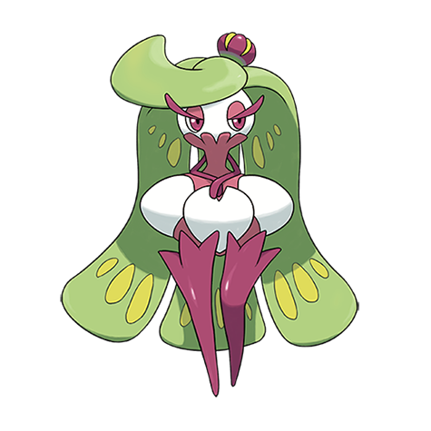

# Tsareena (#0763)

*Fruit Pokemon*

**Type:** Erba
**Abilities:** [[Leaf Guard]], [[Queenly Majesty]], [[Sweet Veil]] *(Hidden)*
**Base HP:** 5

> Tsareena's elegant appearance is only matched by its boastful fight spirit. It is known for disobeying any Trainer giving it orders it dislikes, and will celebrate its victories by kicking its defeated foes while laughing.

---

## Statistiche (Attributes & Limits)

| Attribute | Base / Limit |
|---|---|
| **Strength** | 3/7 |
| **Dexterity** | 2/5 |
| **Vitality** | 3/6 |
| **Special** | 2/4 |
| **Insight** | 3/6 |

---

## Mosse (Learnset)

- **Starter:** [[Splash|Splash]], [[Swagger|Swagger]]
- **Beginner:** [[Rapid_Spin|Rapid Spin]], [[Razor_Leaf|Razor Leaf]], [[Sweet_Scent|Sweet Scent]]
- **Amateur:** [[Double_Slap|Double Slap]], [[Trop_Kick|Trop Kick]], [[Magical_Leaf|Magical Leaf]], [[Teeter_Dance|Teeter Dance]], [[Stomp|Stomp]], [[Aromatic_Mist|Aromatic Mist]], [[Captivate|Captivate]]
- **Ace:** [[Aromatherapy|Aromatherapy]], [[Leaf_Storm|Leaf Storm]], [[High_Jump_Kick|High Jump Kick]]
- **Pro:** [[Acrobatics|Acrobatics]], [[Low_Sweep|Low Sweep]], [[Synthesis|Synthesis]]

---

## Correlati

### Catena Evolutiva
- [[0761_Bounsweet|Bounsweet]]
- [[0762_Steenee|Steenee]]
- [[0763_Tsareena|Tsareena]]

