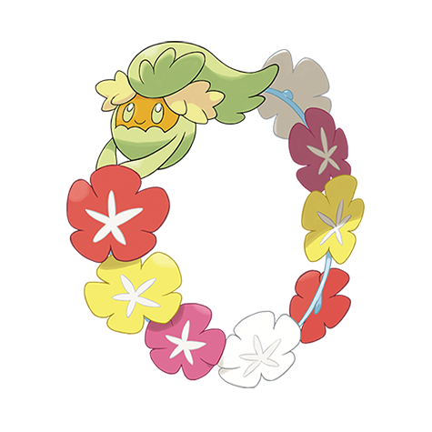

# Comfey (#0764)

*Posy Picker Pokemon*

**Type:** Folletto
**Abilities:** [[Flower Veil]], [[Triage]], [[Natural Cure]] *(Hidden)*
**Base HP:** 4

> This tiny Pokemon gathers flowers and connects them to itself forming a ring. The flowers never wither and their aroma becomes soothing and therapeutic. If it likes you it will create a flower ring just for you.

---

## Statistiche (Attributes & Limits)

| Attribute | Base / Limit |
|---|---|
| **Strength** | 2/4 |
| **Dexterity** | 3/6 |
| **Vitality** | 2/5 |
| **Special** | 2/5 |
| **Insight** | 3/6 |

---

## Mosse (Learnset)

- **Starter:** [[Helping_Hand|Helping Hand]], [[Vine_Whip|Vine Whip]], [[Flower_Shield|Flower Shield]]
- **Beginner:** [[Leech_Seed|Leech Seed]], [[Draining_Kiss|Draining Kiss]], [[Magical_Leaf|Magical Leaf]], [[Growth|Growth]]
- **Amateur:** [[Wrap|Wrap]], [[Sweet_Kiss|Sweet Kiss]], [[Natural_Gift|Natural Gift]], [[Petal_Blizzard|Petal Blizzard]], [[Synthesis|Synthesis]], [[Sweet_Scent|Sweet Scent]]
- **Ace:** [[Grass_Knot|Grass Knot]], [[Floral_Healing|Floral Healing]], [[Petal_Dance|Petal Dance]], [[Aromatherapy|Aromatherapy]], [[Grassy_Terrain|Grassy Terrain]], [[Play_Rough|Play Rough]]
- **Pro:** [[Lucky_Chant|Lucky Chant]], [[Substitute|Substitute]], [[Endure|Endure]]

---

