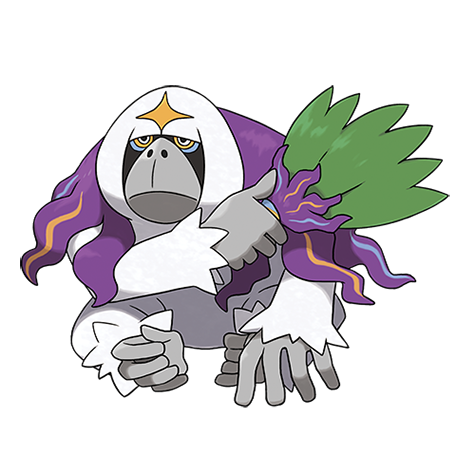

# Oranguru (#0765)

*Sage Pokemon*

**Type:** Normale / Psico
**Abilities:** [[Inner Focus]], [[Telepathy]], [[Symbiosis]] *(Hidden)*
**Base HP:** 4

> These solitary Pokemon live deep in the forests where it provides food and herbal medicine to those in need. It is incredibly smart even learning how to use pokeballs, for that reason it dislikes being ordered around.

---

## Statistiche (Attributes & Limits)

| Attribute | Base / Limit |
|---|---|
| **Strength** | 2/4 |
| **Dexterity** | 2/4 |
| **Vitality** | 2/5 |
| **Special** | 2/5 |
| **Insight** | 3/6 |

---

## Mosse (Learnset)

- **Starter:** [[Confusion|Confusion]], [[After_You|After You]]
- **Beginner:** [[Taunt|Taunt]], [[Quash|Quash]]
- **Amateur:** [[Stored_Power|Stored Power]], [[Psych_Up|Psych Up]], [[Feint_Attack|Feint Attack]], [[Nasty_Plot|Nasty Plot]], [[Zen_Headbutt|Zen Headbutt]], [[Instruct|Instruct]], [[Foul_Play|Foul Play]], [[Calm_Mind|Calm Mind]]
- **Ace:** [[Psychic|Psychic]], [[Future_Sight|Future Sight]], [[Trick_Room|Trick Room]]
- **Pro:** [[Psychic_Terrain|Psychic Terrain]], [[Wonder_Room|Wonder Room]], [[Extrasensory|Extrasensory]]

---

