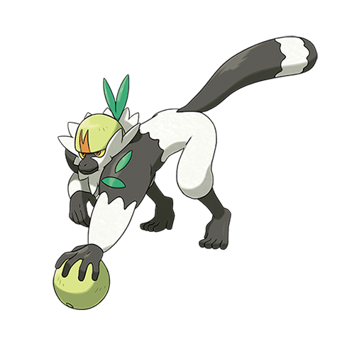

# Passimian (#0766)

*Teamwork Pokemon*

**Type:** Lotta
**Abilities:** [[Receiver]], [[Defiant]] *(Hidden)*
**Base HP:** 5

> They live in packs of 20 members, they are all coordinated to pass around the food and to defend their nest. Their leader is not the strongest but the best teamworker of the pack. A very loyal Pokemon.

---

## Statistiche (Attributes & Limits)

| Attribute | Base / Limit |
|---|---|
| **Strength** | 3/7 |
| **Dexterity** | 2/5 |
| **Vitality** | 2/5 |
| **Special** | 1/3 |
| **Insight** | 2/4 |

---

## Mosse (Learnset)

- **Starter:** [[Tackle|Tackle]], [[Leer|Leer]]
- **Beginner:** [[Rock_Smash|Rock Smash]], [[Focus_Energy|Focus Energy]]
- **Amateur:** [[Beat_Up|Beat Up]], [[Scary_Face|Scary Face]], [[Take_Down|Take Down]], [[Bestow|Bestow]], [[Fling|Fling]], [[Bulk_Up|Bulk Up]]
- **Ace:** [[Double_Edge|Double-Edge]], [[Thrash|Thrash]], [[Close_Combat|Close Combat]], [[Reversal|Reversal]], [[Giga_Impact|Giga Impact]]
- **Pro:** [[Seismic_Toss|Seismic Toss]], [[Iron_Head|Iron Head]], [[Feint|Feint]]

---

