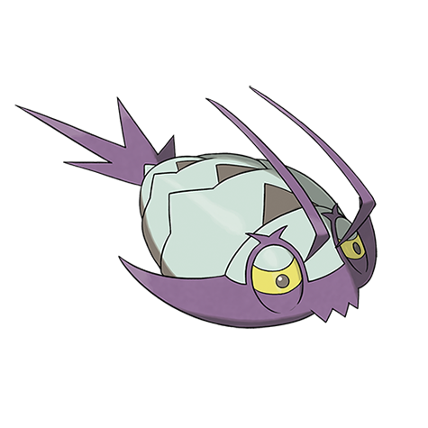

# Wimpod (#0767)

*Turn Tail Pokemon*

**Type:** Insetto / Acqua
**Abilities:** [[Wimp Out]]
**Base HP:** 3

> They are curious but incredibly cowardly Pokemon. They are easily startled and will shoot a stenchy liquid as a warning. Even so, they are highly valued due to their ability to eat and clean any garbage.

---

## Statistiche (Attributes & Limits)

| Attribute | Base / Limit |
|---|---|
| **Strength** | 1/3 |
| **Dexterity** | 2/5 |
| **Vitality** | 1/3 |
| **Special** | 1/3 |
| **Insight** | 1/3 |

---

## Mosse (Learnset)

- **Starter:** [[Struggle_Bug|Struggle Bug]]
- **Beginner:** [[Sand_Attack|Sand Attack]]
- **Ace:** [[Harden|Harden]]
- **Pro:** [[Aqua_Jet|Aqua Jet]], [[Spikes|Spikes]]

---

## Correlati

### Catena Evolutiva
- [[0767_Wimpod|Wimpod]]
- [[0768_Golisopod|Golisopod]]

