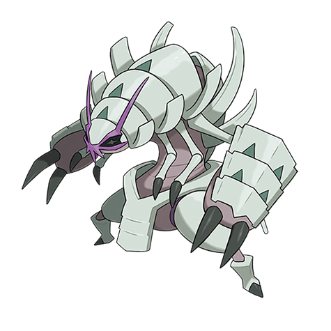

# Golisopod (#0768)

*Hard Scale Pokemon*

**Type:** Insetto / Acqua
**Abilities:** [[Emergency Exit]]
**Base HP:** 7

> This Pokemon is a rare sight, for most Wimpods never evolve and when they do, Golisopod spend most of their lives in deep sea caves, meditating. It is extremely strong, its claws can tear through everything.

---

## Statistiche (Attributes & Limits)

| Attribute | Base / Limit |
|---|---|
| **Strength** | 3/7 |
| **Dexterity** | 1/3 |
| **Vitality** | 3/7 |
| **Special** | 2/4 |
| **Insight** | 2/5 |

---

## Mosse (Learnset)

- **Starter:** [[Struggle_Bug|Struggle Bug]]
- **Beginner:** [[Fury_Cutter|Fury Cutter]], [[Sand_Attack|Sand Attack]], [[Bug_Bite|Bug Bite]], [[Rock_Smash|Rock Smash]]
- **Amateur:** [[First_Impression|First Impression]], [[Spite|Spite]], [[Swords_Dance|Swords Dance]], [[Slash|Slash]], [[Razor_Shell|Razor Shell]], [[Sucker_Punch|Sucker Punch]], [[Pin_Missile|Pin Missile]]
- **Ace:** [[Iron_Defense|Iron Defense]], [[Liquidation|Liquidation]]
- **Pro:** [[Wide_Guard|Wide Guard]], [[Metal_Claw|Metal Claw]], [[Aqua_Jet|Aqua Jet]]

---

## Correlati

### Catena Evolutiva
- [[0767_Wimpod|Wimpod]]
- [[0768_Golisopod|Golisopod]]

