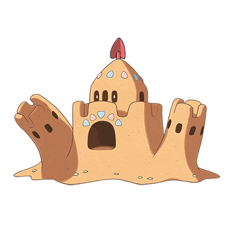

# Palossand (#0770)

*Sand Castle Pokemon*

**Type:** Spettro / Terra
**Abilities:** [[Water Compaction]], [[Sand Veil]] *(Hidden)*
**Base HP:** 4

> The possessed people shaped this Pokemon into a castle, buried beneath the sand where it stands are the remains of all its victims. Some say these unmarked graves will give birth to a new Sandygast.

---

## Statistiche (Attributes & Limits)

| Attribute | Base / Limit |
|---|---|
| **Strength** | 2/5 |
| **Dexterity** | 1/3 |
| **Vitality** | 3/6 |
| **Special** | 3/6 |
| **Insight** | 2/5 |

---

## Mosse (Learnset)

- **Starter:** [[Harden|Harden]], [[Absorb|Absorb]], [[Astonish|Astonish]], [[Sand_Attack|Sand Attack]]
- **Beginner:** [[Sand_Tomb|Sand Tomb]], [[Mega_Drain|Mega Drain]]
- **Amateur:** [[Bulldoze|Bulldoze]], [[Hypnosis|Hypnosis]], [[Iron_Defense|Iron Defense]], [[Giga_Drain|Giga Drain]], [[Shadow_Ball|Shadow Ball]]
- **Ace:** [[Earth_Power|Earth Power]], [[Shore_Up|Shore Up]], [[Sandstorm|Sandstorm]]
- **Pro:** [[Rock_Polish|Rock Polish]], [[Destiny_Bond|Destiny Bond]], [[Earthquake|Earthquake]]

---

## Correlati

### Catena Evolutiva
- [[0769_Sandygast|Sandygast]]
- [[0770_Palossand|Palossand]]

