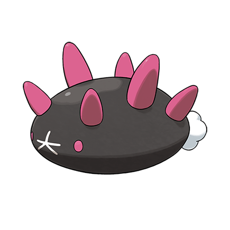

# Pyukumuku (#0771)

*Sea Cucumber Pokemon*

**Type:** Acqua
**Abilities:** [[Innards Out]], [[Unaware]] *(Hidden)*
**Base HP:** 4

> Once this Pokemon finds a spot it likes it will remain there without moving, even if food is out of reach. It can expel its organs through its mouth and use them like an arm. It’s slimy and not many people like it.

---

## Statistiche (Attributes & Limits)

| Attribute | Base / Limit |
|---|---|
| **Strength** | 2/4 |
| **Dexterity** | 1/1 |
| **Vitality** | 3/7 |
| **Special** | 1/3 |
| **Insight** | 3/7 |

---

## Mosse (Learnset)

- **Starter:** [[Mud_Sport|Mud Sport]], [[Water_Sport|Water Sport]], [[Harden|Harden]]
- **Beginner:** [[Baton_Pass|Baton Pass]], [[Bide|Bide]], [[Helping_Hand|Helping Hand]]
- **Amateur:** [[Taunt|Taunt]], [[Safeguard|Safeguard]], [[Counter|Counter]], [[Purify|Purify]], [[Curse|Curse]], [[Gastro_Acid|Gastro Acid]], [[Pain_Split|Pain Split]]
- **Ace:** [[Recover|Recover]], [[Soak|Soak]], [[Toxic_Spikes|Toxic Spikes]], [[Memento|Memento]]
- **Pro:** [[Bestow|Bestow]], [[Venom_Drench|Venom Drench]], [[Tickle|Tickle]]

---

