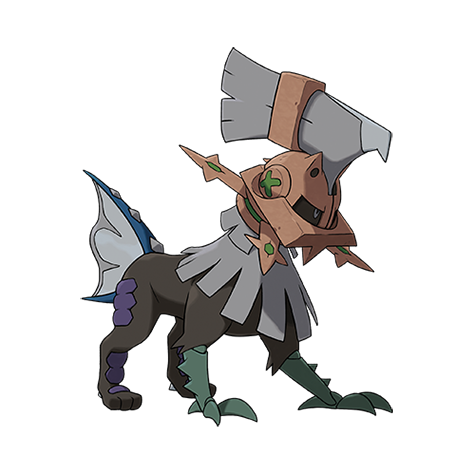

# Type: Null (#0772)

*Synthetic Pokemon*

**Type:** Normale
**Abilities:** [[Battle Armor]]
**Base HP:** 3

> A synthetic Pokemon made by the Aether Foundation. Currently only three specimens exist in cryogenic stasis, but they are deemed too dangerous even with a limiter helmet on. They must never be reanimated.

---

## Statistiche (Attributes & Limits)

| Attribute | Base / Limit |
|---|---|
| **Strength** | 3/6 |
| **Dexterity** | 2/4 |
| **Vitality** | 3/6 |
| **Special** | 3/6 |
| **Insight** | 3/6 |

---

## Mosse (Learnset)

- **Starter:** [[Tackle|Tackle]]
- **Beginner:** [[Rage|Rage]], [[Pursuit|Pursuit]]
- **Amateur:** [[Imprison|Imprison]], [[Aerial_Ace|Aerial Ace]], [[Crush_Claw|Crush Claw]], [[Scary_Face|Scary Face]], [[X_Scissor|X-Scissor]], [[Take_Down|Take Down]], [[Metal_Sound|Metal Sound]], [[Iron_Head|Iron Head]], [[Double_Hit|Double Hit]]
- **Ace:** [[Air_Slash|Air Slash]], [[Punishment|Punishment]], [[Razor_Wind|Razor Wind]]
- **Pro:** [[Tri_Attack|Tri Attack]], [[Double_Edge|Double-Edge]], [[Heal_Block|Heal Block]]

---

