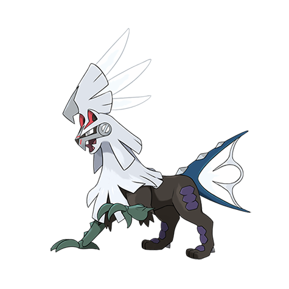

# Silvally (#0773)

*Synthetic Pokemon*

**Type:** Normale
**Abilities:** [[RKS System]]
**Base HP:** 4

> Pokedex has no data. It was seen in the company of a boy. It appears to be a perfected or evolved form of Type: Null. The boy gave it some strange disks that allowed it to change its type.

---

## Statistiche (Attributes & Limits)

| Attribute | Base / Limit |
|---|---|
| **Strength** | 3/6 |
| **Dexterity** | 3/6 |
| **Vitality** | 3/6 |
| **Special** | 3/6 |
| **Insight** | 3/6 |

---

## Mosse (Learnset)

- **Starter:** [[Tackle|Tackle]]
- **Beginner:** [[Rage|Rage]], [[Pursuit|Pursuit]]
- **Amateur:** [[Multi_Attack|Multi-Attack]], [[Heal_Block|Heal Block]], [[Imprison|Imprison]], [[Iron_Head|Iron Head]], [[Poison_Fang|Poison Fang]], [[Fire_Fang|Fire Fang]], [[Ice_Fang|Ice Fang]], [[Thunder_Fang|Thunder Fang]], [[Bite|Bite]], [[Aerial_Ace|Aerial Ace]], [[Crush_Claw|Crush Claw]], [[Scary_Face|Scary Face]], [[X_Scissor|X-Scissor]], [[Take_Down|Take Down]], [[Metal_Sound|Metal Sound]], [[Double_Hit|Double Hit]]
- **Ace:** [[Crunch|Crunch]], [[Air_Slash|Air Slash]], [[Punishment|Punishment]], [[Razor_Wind|Razor Wind]]
- **Pro:** [[Tri_Attack|Tri Attack]], [[Double_Edge|Double-Edge]], [[Parting_Shot|Parting Shot]]

---

